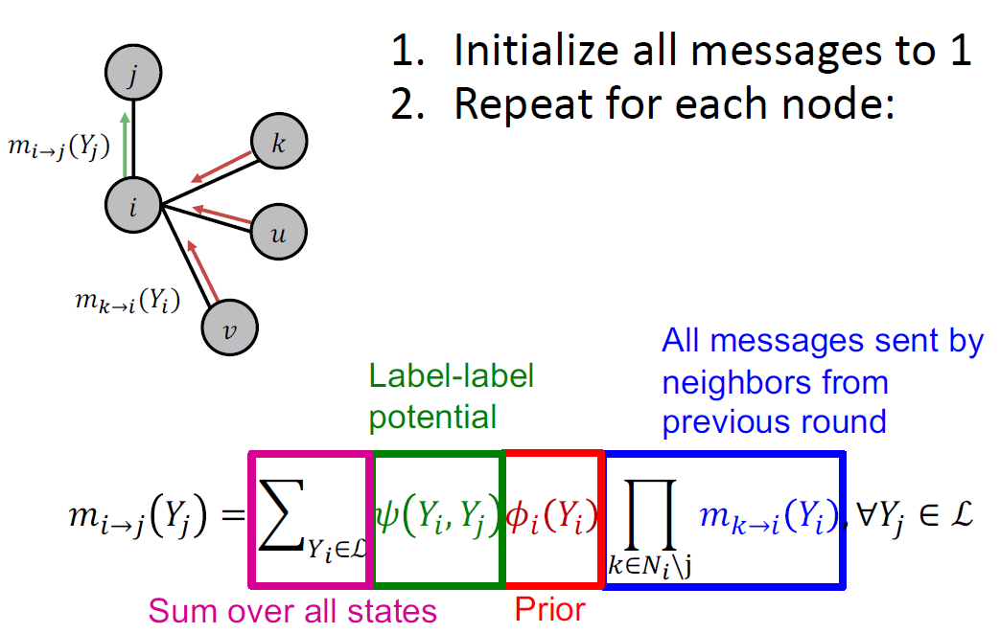
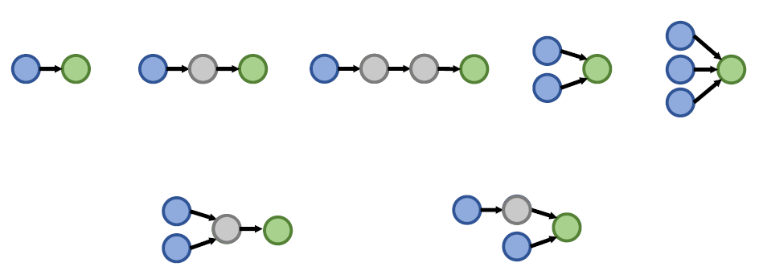
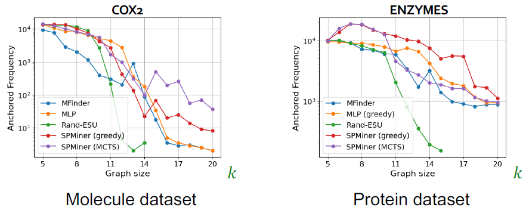
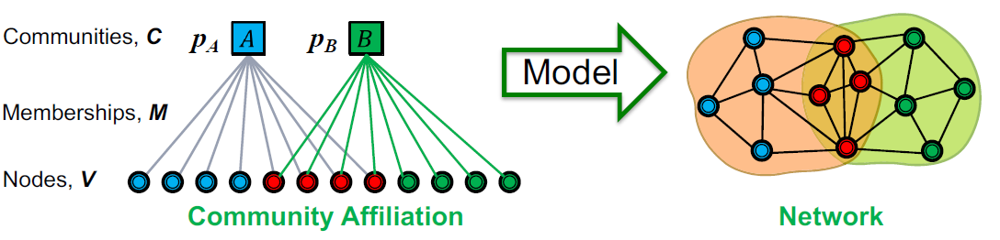
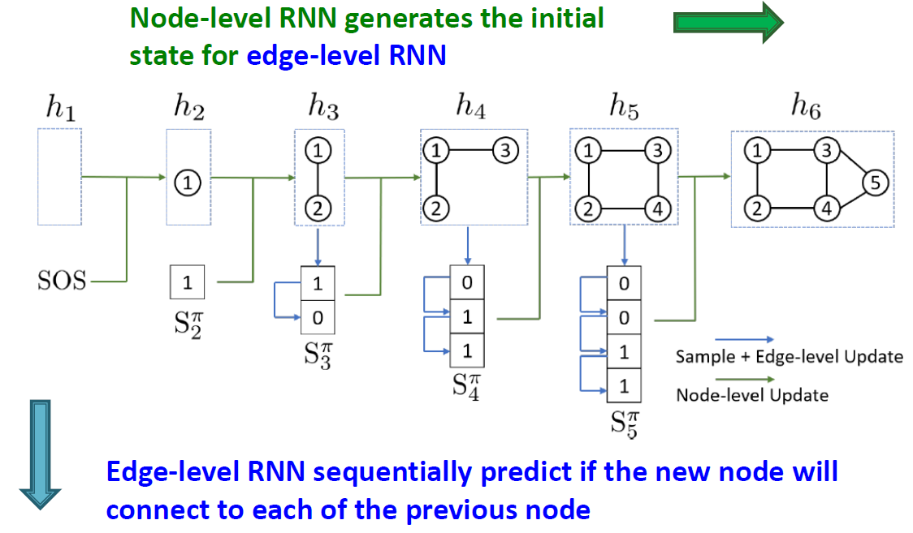

# Lecture1: Introduction

## Machine Learning for Graphs

### 网络复杂的原因

1. 网络的大小不固定，具有复杂的拓扑结构
2. 没有固定的节点顺序或者参考节点
3. 通常是动态并且多模态的

### 深度学习处理图的流程

输入为网络，经过神经网络后输出预测结果。

## Applications of Graph ML

### 任务层级

* 节点分类：预测节点性质，如分类用户和条目
* 关系预测：预测两个节点间是否存在缺失的关联，如知识图谱补全（Knowledge Graph Completion）
* 图分类：分类不同的图，如分子性质预测
* 聚类：确定节点是否来自于同一个群类，如社交圈检测
* 其他：图生成（如药物研发），图进化（如物理模拟）

### 图机器学习应用示例

#### Node Level：基于氨基酸序列预测其3D结构

#### Edge Level：推荐系统

根据已有用户-条目关联预测可能的关联。

#### Edge Level：药物副作用预测

建立节点为药物或蛋白质，边为交互关系的图网络，分析不同药物之间可能产生的副作用。

#### Subgraph Level：路线规划

节点为道路区间，边为道路区间之间的联系，自动选择最优路线。

#### Graph Level：药物研发

节点为原子，边为化学键，通过图分类的方法从可能的原子结构中缩小药物选择空间。

#### Graph Level：物理仿真

节点为质点，边为质点间相互作用，模拟真实物理世界中的质点相互作用。

## Choice of Graph Representation

### 网络的部件

* 对象：节点，$N$
* 交互作用：关联、边，$E$
* 系统：网络、图，$G(N,E)$

### 图的表示

#### 矩阵表示

定义方阵$A$，如果$A_{ij}=1$则表示节点$i$和节点$j$之间存在关联，如果$A_{ij}=0$则表示节点$i$和节点$j$之间不存在关联。

这种表示方法存在的最大问题是过于稀疏，对于大型图网络而言，矩阵过于稀疏将大大降低运算效率。

#### 边列表表示

将相互关联的两个节点记录下来，形成一个列表。

#### 邻接表表示

适合用于大型稀疏网络，记录一个节点的邻域节点。

### 图的分类

#### 有向图与无向图

对于无向图而言，定义：

节点的度（Node Degree，$k_i$）：第$i$个节点关联的边的条数

度的均值（Avg. degree）：$\bar{k}=<k>=\dfrac{1}{N}\sum_{i=1}^{N}{k_i}=\dfrac{2E}{N}$

对于有向图而言，定义：

节点的入度（Node in-Degree，$k^{in}_{i}$）：第$i$个节点关联的朝向该节点的边的条数

节点的出度（Node out-Degree，$k^{out}_{i}$）：第$i$个节点关联的背离该节点的边的条数

源节点（Source）：$k^{in}=0$

汇聚节点（Sink）：$k^{out}=0$

度的均值：$\bar{k}^{in}=\bar{k}^{out}=\dfrac{E}{N}$

#### 双偶图（Bipartite Graph）

双偶图的节点可分为两个不相交的集合$U$和$V$，使每条链路将$U$中的节点连接到$V$中的节点。也就是说，$U$和$V$是**独立的集合**。

#### 折叠/投影双偶图（Folded/Projected Bipartite Graph）

基于双偶图构建投影$U$和投影$V$。

#### 加权图（Weighted Graph）

边的权重不同。

#### 自关联图（Slef-edges Graph）

#### 多关联图（Multigraph）

#### 非联通图（Disconnected Graph）

非联通图由多个连通图或者独立节点共同构成。

可以通过矩阵表示来判断一个图是否为非联通图。非连通图的矩阵可以分割为几个包含非0值的小矩阵，而连通图无法分割。

#### 强连通有向图（Strongly Connected Directed Graph）

通过有向图的任何一个节点都可以到达其余的任何一个节点。

#### 弱连通有向图（Weekly Connected Directed Graph）

忽略边的方向可以从有向图的任何一个节点到达其余任何一个节点。

#### 强连通区域（Strongly Connected Component，SCC）

强连通区域为有向图中可以满足任何一个节点都可以到达其余任何一个节点的区域。定义in-component为可以到达SCC的节点，out-component为SCC可以到达的节点。

# Lecture2: Traditional Methods for Machine Learning in Graphs

目标为给定一个新的节点、边或者图，能够从中获取特征并且做出预测。传统机器学习的方法采用手动设计的特征（Hand-designed Feature）。

## Node-level Tasks and Features

### 节点中心性（Node Centrality）

节点的度$k_v$只计算了邻域节点的个数而没有考虑它们的重要性。

节点中心性$c_{v}$将图中节点重要性纳入了计算，有多种计算方法：特征值中心性（Engienvector centrality），中介中心性（Betweennes centrality），接近中心性（Closeness centrality）等等。

#### 特征值中心性（Engienvector centrality）

节点$v$的邻域为$u \in N(v)$，那么定义节点$v$的中心性为其邻域节点中心性的和：
$$
c_{v}=\frac{1}{\lambda} \sum_{u \in N(v)} c_{u}
$$
其中$\lambda$为正实数。

为了解决定义的递归性，定义节点中心性向量$\vec{c}=[c_1, c_2, \dots, c_n]$，定义关系矩阵$A,and \space A_{uv}=1,if \space u \in N(v)$，那么式（1）可以用向量与矩阵的运算进行替代：
$$
\lambda \vec{c} = A \vec{c}
$$
此时$\lambda$为矩阵$A$的特征值，选取最大的$\lambda_{max}$，由Perron-Frobeniu定理可知$\lambda_{max}>0$，此时对应的特征向量即为所求的中心性向量$\vec{c}$。

#### 中介中心性（Betweennes centrality）

一个节点如果在另外两个节点之间的最短路径上，那么这个节点的重要性会提高，那么有：
$$
c_{v}=\sum_{s \neq v \neq t} \frac{\#(\text { shortest paths betwen } s \text { and } t \text { that contain } v)}{\#(\text { shortest paths between } s \text { and } t)}
$$

#### 接近中心性（Closeness centrality）

一个节点到其他所有节点所需要的最短路径越短，这个节点越重要。
$$
c_{v}=\frac{1}{\sum_{u \neq v} \text { shortest path length between } u \text { and } v}
$$

### 聚集系数（Clustering Coefficient）

聚集系数用于表征一个节点的邻域节点的关联程度。

如果三个节点彼此两两相连，那么这三个节点被定义为闭三点组，记为$G_{\Delta}$。如果三个节点除了一条边没有相连，其他的两条边相连，那么这三个节点被称为开三点组，记为$G_{\wedge}$。聚集系数的定义为，一个图中所有**闭三点组**的数目除以所有**三点组**的数目：
$$
e_v(G)=\frac{3 \times G_{\Delta}}{3 \times G_{\Delta}+G_{\wedge}}
$$
由于闭三点组可以以三个节点任何一个节点作为顶点，因此需要乘以3。

式（5）可以根据节点的度转化为：
$$
e_{v}=\frac{\#(\text { edges among neighboring nodes })}{\left(\begin{array}{c}
k_{v} \\
2
\end{array}\right) } \in[0,1], \left(\begin{array}{c}
k_{v} \\
2
\end{array}\right)=C^{k_v}_{2}=\dfrac{k_v!}{(k_v-2)!(2)!}
$$

### Graphlet度向量（Graphlet Degree Vector，GDV）

Graphlet定义为有根连接的非同构子图，对于不同大小的graphlet有不同的子图结构。

类似于节点的度，Graphlet度向量计算以节点为根时，给定graphlet列表中各个graphlet出现的次数，不同graphlet出现的次数共同构成该节点的Graphlet度向量。

Graphlet度向量给出了一种计算节点本地网络拓扑度的方法。

## Link Prediction Task and Features

### 任务目标

基于现有的边预测新的边，核心问题是如何描述一对节点之间的关系。

### 预测模式

1. 删除随机的边，然后去预测这些边。
2. 用现有的图$G(t_0,t_0')$的边特征进行训练，得到一套新的图$G(t_1,t_1')$。取新图内排名前n的边与原图的边进行比对，重合率越高，预测性能越好。

### 边的特征表示（Link-Level Features）

#### 基于距离的边特征（Distance-based feature）

用两个节点之间的最短距离作为表征边的特征。

#### 局部邻域重叠特征（Local neighborhood overlap）

* 共同邻域：$\left|N\left(v_{1}\right) \cap N\left(v_{2}\right)\right|$
* Jaccard系数：$\dfrac{\left|N\left(v_{1}\right) \cap N\left(v_{2}\right)\right|}{\left|N\left(v_{1}\right) \cup N\left(v_{2}\right)\right|}$
* Adamic-Adar系数：$\sum_{u \in N\left(v_{1}\right) \cap N\left(v_{2}\right)} \dfrac{1}{\log \left(k_{u}\right)}$

局部领域特征会忽视具有间接联系的节点关系，例如两个节点的邻域不重合，但是邻域之间有直接联系。

#### 全局邻域重叠特征（Global neighborhood overlap）

Katz系数：计算两个节点之间所有长度的路径数目。采用图邻接矩阵（graph adjacency matrix）进行计算。

令$P_{kv}^{K}$为节点$u$和节点$v$之间长度为$K$的路径数目，那么有$P^{(1)}=A$。

当$K=2$时，需要计算节点$u$和节点$v$之间长度为2的路径，计算方法为先找到节点$u$路径为1的所有节点$A_{ui}$，然后将这些节点与节点$v$是否相关联$P_{iv}^{(1)}$相乘，即可得到最后的结果，那么有：
$$
P_{u v}^{(2)}=\sum_{i} A_{u i} * P_{i v}^{(1)}=\sum_{i} A_{u i} * A_{i v}=A_{u v}^{2}
$$
以此类推，可以得到：
$$
P^{(K)}=A^{k}
$$
将所有长度的路径系数相叠加，并且对较长的路径基于损失系数$0<\beta<1$，就可以计算得到节点$u$和节点$v$之间的Katz系数：
$$
S_{uv}=\sum_{l=1}^{\infty}{\beta^{l}A_{uv}^{l}} \\
\boldsymbol{S}=\sum_{i=1}^{\infty} \beta^{i} \boldsymbol{A}^{i} = (\boldsymbol{I}-\beta \boldsymbol{A})^{-1}-\boldsymbol{I}
$$

## Graph-Level Feature and Graph Kernels

### 核方法（Kernel Method）

核方法的思路是希望找到一个函数$\phi$，使得数据集$G$能够映射到其他维度的空间，便于提取数据集特征。

对于映射到其他维度的空间的数据集$\phi(G)$，计算两个数据之间的距离有：
$$
\begin{aligned}
&\left\|\phi(x)-\phi\left(x^{\prime}\right)\right\|^{2} \\
&=\left(\phi(x)-\phi\left(x^{\prime}\right)\right)^{T}\left(\phi(x)-\phi\left(x^{\prime}\right)\right) \\
&=\phi(x)^{T} \phi(x)-2 \phi(x)^{T} \phi\left(x^{\prime}\right)+\phi\left(x^{\prime}\right)^{T} \phi\left(x^{\prime}\right) \\
&=<\phi(x), \phi(x)>-2<\phi(x), \phi\left(x^{\prime}\right)>+<\phi\left(x^{\prime}\right), \phi\left(x^{\prime}\right)>
\end{aligned}
$$
计算两个数据间的夹角有：
$$
\begin{aligned}
&<\phi(x), \phi\left(x^{\prime}\right)>\\
&=\|\phi(x)\| \cdot\left\|\phi\left(x^{\prime}\right)\right\| \cos \theta \\
&\Rightarrow \cos \theta=\frac{<\phi(x), \phi\left(x^{\prime}\right)>}{\|\phi(x)\| \cdot\left\|\phi\left(x^{\prime}\right)\right\|}=\frac{<\phi(x), \phi\left(x^{\prime}\right)>}{\sqrt{<\phi(x), \phi(x)>} \sqrt{<\phi\left(x^{\prime}\right), \phi\left(x^{\prime}\right)>}}
\end{aligned}
$$
那么可以定义核函数$\kappa(x, x')=<\phi\left(x^{\prime}\right), \phi\left(x^{\prime}\right)>$，则可以由卷积核直接计算出数据距离和夹角，因此向高维空间的映射在一些情况下可以不需要知道映射函数$\phi$，只需要知道核函数$\kappa$即可完成特征的提取。

常用的核函数有：

* 线性核函数：$\kappa(x, z)=<x, z>$
* 指数核函数：$\kappa(x, z)=(<x, z>+1)^{r}, r \in Z^{+}$
* 高斯（RBF）核函数：$\kappa(x, z)=\exp \left(\dfrac{-\|x-z\|^{2}}{2 \sigma^{2}}\right), \sigma \in R-\{0\}$

### 图核函数（Graph Kernels）

计算两个图之间的相似度。包括Graphlet Kernel，Weisfeiler-Lehman Kernel，Random-walk Kernel，Shortest-path graph kernel等等。

图核函数一般基于词袋模型（Bag-of-Words，BoW）的思想进行构建，通过统计不同类型的特征数目，构成向量，形成图核函数。

#### 基于节点数目构建

统计图当中节点的数目，数目相同即表示图相同。

#### 基于节点的度构建

统计不同的度的节点的数目，组成度向量，比较度向量之间的区别。

#### 基于graphlet的数目构建（Graphlet Kernel）

与节点级别的graphlet不同的是，图级别的graphlet需要考虑节点之间是否存在连接，并作出区分，而不需要考虑以哪一个节点作为根节点的问题。

对于指定的grahlet列表，即可用BoW的思想统计出graphlet向量$\boldsymbol{f}$，考虑到不同大小的图之间存在数量级的偏置，因此对结果进行归一化处理$\boldsymbol{h}_{G}=\dfrac{\boldsymbol{f}_{G}}{\operatorname{Sum}\left(\boldsymbol{f}_{G}\right)}$。

基于$\boldsymbol{h}$可以计算graphlet核函数：
$$
\kappa (G, G') = \boldsymbol{h}_G^T\boldsymbol{h}_{G'}
$$
graphlet核函数的向量得到过程开销过大。对于统计大小为n的图中大小为k的graphlet，列举出来有$n^k$个。如果一个图中节点的度最多为$d$，那么统计所有大小为k的graphlet的算法复杂度为$O(nd^{k-1})$。

因此需要更加高效的图核函数进行计算。

#### Weisfeiler-Lehman Kernel

制作一个Hash表，算法通过检索Hash表可以根据当前节点的颜色$c(v)$与节点周围节点的颜色$c(u), u\in N(v)$计算出下次迭代中节点的颜色，即：
$$
c^{(k+1)}(v)=\operatorname{HASH}\left(\left\{c^{(k)}(v),\left\{c^{(k)}(u)\right\}_{u \in N(v)}\right\}\right)
$$
这种方法在每次迭代的过程中将节点与其邻域的信息进行了压缩，在多次迭代过后，当前节点的颜色能够表征足够大感知范围的图关系，进而实现了对图特征的表征。最后统计各个颜色节点的数量，构成向量即可实现图的核函数。

这种方法在时间复杂度上是线性的，因此具有较高的计算效率。

# Lecture3: Node Embedding

传统机器学习的方法需要在基于任务对图的特征进行构建，那么有没有一种方法能够不基于特定任务完成图特征的描述呢？Node Embedding是一种解决思路。

Node Embedding的思路是将节点映射到嵌入空间（embedding space）。相似的embedding表明节点在图中的相似度很高，因此可以用embedding的结果编码（encode）网络信息。

## Node Embedding: Encoder and Decoder

### 定义

encoder用于将节点映射到嵌入空间，decoder将嵌入空间的信息转化为相似度评分（similarity score），优化目标为对于相似的节点给出更高的评分。例如用encoder将节点$u$和节点$v$映射为$\boldsymbol{z}_u, \boldsymbol{z}_v$，采用最基础的decoder，即点乘计算其相似度，那么有：
$$
\text{similarity}（u，v）\approx \boldsymbol{z}_v^T \boldsymbol{z}_u
$$

### 浅编码（“shallow” encoding）

对于每一个节点都有一个映射向量，假设一个图内有$|V|$个节点，将每个节点映射为$d$维向量。那么将每个节点的向量按列拼接在一起，即可构成浅编码矩阵$Z \in \mathbb{R}^{d \times|\mathcal{V}|}$，那么对于特定节点$v$而言，令向量$\boldsymbol{v} \in \mathbb{I}^{|\mathcal{V}|}$，只有$\boldsymbol{v}_v =1$，那么可以取出对应的编码：
$$
\operatorname{ENC}(v)=\mathbf{z}_{v}=\mathbf{Z} \cdot v
$$

## Random Walk Approaches for Node Embeddings

### 声明

$\boldsymbol{z}_u$：节点$u$的嵌入空间向量。

$P(v|\boldsymbol{z}_u)$：从节点$u$出发通过随机行走经过节点$v$的可能性。

$\sigma(z)_{i}=\dfrac{e^{z_{i}}}{\sum_{j=1}^{K} e^{z_{j}}}$：softmax函数，将实数转化为概率的函数。

$S(x)=\dfrac{1}{1+e^{-x}}$：sigmoid函数，将数值压缩到$(0,1)$区间的函数。

### 随机行走嵌入法（Random Walk Embedding）

1. 使用随机行走策略R估计从节点$u$开始的随机行走中访问节点$v$的概率。
2. 优化编码策略，使得嵌入空间向量的相似度与随机行走概率吻合。

采用随机行走法的优势在于2点：

1. 表达性：具有灵活的随机节点相似度定义，包含局部和高阶邻域信息。
2. 高效性：训练时不需要考虑所有节点对;只需要考虑随机游动中同时出现的配对。

### 无监督特征学习策略

类似于NLP中的CBOW方法，我们希望能够找到一种映射规则，使得通过节点$u$的嵌入函数能够预测其邻域节点的嵌入函数，即优化：
$$
\max _{f} \sum_{u \in V} \log \mathrm{P}\left(N_{\mathrm{R}}(u) \mid \mathbf{z}_{u}\right)
$$
其中$N_R(u)$是在策略R的前提下，节点$u$的邻域节点。

那么对于一整个图$G$而言，优化目标为：
$$
\mathcal{L}=\sum_{u \in V} \sum_{v \in N_{R}(u)}-\log \left(P\left(v \mid \mathbf{z}_{u}\right)\right), \space P\left(v \mid \mathbf{z}_{u}\right)=\dfrac{\exp \left(\mathbf{z}_{u}^{\mathrm{T}} \mathbf{z}_{v}\right)}{\sum_{n \in V} \exp \left(\mathbf{z}_{u}^{\mathrm{T}} \mathbf{z}_{n}\right)}
$$
然而计算式（17）的开销为$O(|V|^2)$，因此考虑对概率的表示进行优化。$\sum_{n \in V} \exp \left(\mathbf{z}_{u}^{\mathrm{T}} \mathbf{z}_{n}\right)$使得计算邻域节点重要性时，需要对整个图的向量进行计算，让复杂度乘以了$|V|$，因此用负样本采样（Negative Sampling）的方法对概率进行了近似处理，有：
$$
\begin{aligned}
&\log \left(\frac{\exp \left(\mathbf{z}_{u}^{\mathrm{T}} \mathbf{z}_{v}\right)}{\sum_{n \in V} \exp \left(\mathbf{z}_{u}^{\mathrm{T}} \mathbf{z}_{n}\right)}\right)\\
&\approx \log \left(\sigma\left(\mathbf{z}_{u}^{\mathrm{T}} \mathbf{z}_{v}\right)\right)-\sum_{i=1}^{k} \log \left(\sigma\left(\mathbf{z}_{u}^{\mathrm{T}} \mathbf{z}_{n_{i}}\right)\right), n_{i} \sim P_{V}
\end{aligned}
$$
式（18）中的$n_i$为随机采样的负样本，用于减少计算量。$k$的值越大，结果越准确，但是开销也越大，因此实际应用过程中一般采用$k=5 \sim 20$。

### 优化方法

#### 梯度下降法

1. 对于所有$i$随机初始化$z_i$。
2. 迭代至收敛：
   * 计算梯度$\dfrac{\partial \mathcal{L}}{\partial z_{i}}$
   * 根据预定义学习率$\eta$，更新$z_i$的值，$z_{i} \leftarrow z_{i}-\eta \dfrac{\partial \mathcal{L}}{\partial z_{i}}$

#### Stochastic梯度下降法

相较于简单的梯度下降，Stochastic梯度下降法考虑到了每一个训练样本的梯度，即将迭代细分了一层。

1. 对于所有$i$随机初始化$z_i$。
2. 对函数$\mathcal{L}^{(u)}=\sum_{v \in N_{R}(u)}-\log \left(P\left(v \mid \mathbf{z}_{u}\right)\right)$迭代至收敛：
   * 计算所有邻域节点$j$的梯度$\dfrac{\partial \mathcal{L^{(i)}}}{\partial z_{j}}$。
   * 根据预定义学习率$\eta$，更新$z_j$的值，$z_{j} \leftarrow z_{j}-\eta \dfrac{\partial \mathcal{L^{(i)}}}{\partial z_{j}}$。

### 随机行走策略

深度优先（DFS)和广度优先（BFS）。

#### DFS和BFS的实现方法

定义两个参数：

* 返回参数$p$：表示返回根节点的权重。
* 出入参数$q$：表示远离根节点的权重。

那么在下图中，对于从$s_1$出发，沿着$(s_1,w)$边移动过后，节点随机到余下四个节点的概率可以表示为：

对于更加偏重于BFS的随机行走而言，会有更小的$p$，而对于更加偏重于DFS的随机行走而言，会有更小的$q$。

### node2vec算法

1. 计算随机行走概率
2. 模拟r次从每一个节点$u$出发行走$l$步长的随机行走结果，获取$N_R(u)$
3. 利用Stochastic梯度下降法优化目标函数$\mathcal{L}$。

## Embedding Entire Graphs

目标是将整个图或者子图映射为一个嵌入向量$\boldsymbol{z}_G$。任务为区分有毒（Toxic）和无毒（non-Toxic）的元素，识别异常图。

### 求和法

将所有节点的嵌入向量加起来，得到图的嵌入向量$\boldsymbol{z}_G$：
$$
\mathbf{z}_{G}=\sum_{v \in G} \boldsymbol{z}_{v}
$$

### 虚拟点法

在图的外部虚拟一个节点与其他所有节点相连，计算该节点的嵌入向量等同于图的嵌入向量。

### 匿名行走法（Anonymous Walk Embeddings）

匿名行走是将随机行走的路径抽象化为graphlet模板的形式，如下图：

匿名行走的匿名性体现在只考虑节点出现的顺序，不考虑节点本身的性质，如前两个图虽然路过的节点不同，但是顺序相同就可以抽象化为同一种模板。有了一套模板之后可以参考BoW的方法统计各个模板出现的次数，进而形成图嵌入向量。

这种匿名行走模板的可能性随着步长的增加指数提升，如下图所示

我们需要进行的随机行走次数$m$可以用式（20）计算：
$$
m=\left\lceil\frac{2}{\varepsilon^{2}}\left(\log \left(2^{\eta}-2\right)-\log (\delta)\right)\right\rceil
$$
其中$\eta$为在步长为$l$的时候，存在的模板个数。$\varepsilon$表示在概率低于$\delta$的前提下，我们预测的分布误差大于$\varepsilon$。

例如对于步长为7的匿名行走，有877个模板，即$\eta=877$，我们希望在低于$1\%$的概率下分布的误差大于$0.1$，此时$\delta=0.01, \varepsilon=0.1$，带入公式计算可得，需要进行122500次随机行走。

根据随机行走得到的结果进行统计，可以得到不同模板出现的概率，进而得到$Z=\left\{z_{i}: i=1 \ldots m\right\}$。

### 学习行走嵌入（Learn Walk Embedding）

对于得到的随机行走结果$(w_1, w_2, \dots, w_m)$，除了采用计算各个模板出现的概率之外，考虑利用图嵌入向量对模板的出现进行预测。

在一个固定的采样窗口$\Delta$内，根据图嵌入向量我们希望能够预测此时出现的模板，并使得其概率达到最大。
$$
\max \dfrac{1}{m} \sum_{t=\Delta}^{m-\Delta} \log P\left(w_{t} \mid w_{t-\Delta}, \ldots, w_{t+\Delta}, \mathbf{z}_{G}\right)
$$
建立$\mathbf{z}_{G}$与$P$之间的联系：
$$
P\left(w_{t} \mid\left\{w_{t-\Delta}, \ldots, w_{t+\Delta}, \boldsymbol{Z}_{\boldsymbol{G}}\right\}\right)=\frac{\exp \left(y\left(w_{t}\right)\right)}{\sum_{i=1}^{\eta} \exp \left(y\left(w_{i}\right)\right)} \\
y\left(w_{t}\right)=b+U \cdot\left(\operatorname{cat}\left(\frac{1}{2 \Delta} \sum_{i=-\Delta}^{\Delta} z_{i}, \mathbf{z}_{G}\right)\right) \\
$$

其中$\eta$表示负样本采样个数，$b \in \mathbb{R}, U \in \mathbb{R}^{D}$是超参数，$cat$表示将两个向量拼接在一起。

# Lecture4: Link Analysis: PageRank

## Graph as Matrix: PageRank, Random Walks and Embeddings

### PageRank (aka the Google Algorithm)

PageRank最初需要解决的问题是网页重要性的排序，Google的思路是将网络页面之间的链接看作由一个网页节点指向另一个网页节点的单向连接，那么整个网络页面就可以抽象化为有向图。用户的浏览被视作在有向图内的随机行走（Random Walks）。

PageRank需要对网页节点进赋予权重，最简单的思路即为用节点的in-degree作为网页节点的权重，因为指向节点的路径越多，节点越容易被访问。

考虑到来自权重高的节点的路径应当赋予更高的权重（用户更容易从高权重的节点来访问当前节点），因此考虑到前一个节点的权重，将权重根据out-degree进行等分，得到PageRank的算法：
$$
r_{j}=\sum_{i \rightarrow j} \dfrac{r_{i}}{d_{i}}, \space d_i是节点i的\text{out-degree}
$$

那么问题转化为了迭代的过程，节点的权重随着迭代不断更新。对于有向图$G$由矩阵$\boldsymbol{M}$表示节点间的关联，令$\boldsymbol{r}=[r_1,r_2, \ldots, r_n]$表示节点的权重，那么迭代公式为：
$$
\boldsymbol{r}^{t+1} = \boldsymbol{M} \cdot \boldsymbol{r}^{t}
$$
迭代的终点为$\boldsymbol{r}^{t+1} = \boldsymbol{r}^{t}$，因此式（24）在收敛时，有：
$$
1 \cdot \boldsymbol{r}=\boldsymbol{M} \cdot \boldsymbol{r}
$$
由式（25）可以看出，在Random Walks收敛的时候，$\boldsymbol{r}$是矩阵$\boldsymbol{M}$特征值为1对应的主要特征向量（principal eigenvector），这种方法被称为**幂迭代（Power Iteration）**。

## PageRank: How to solve?

图矩阵$\boldsymbol{M}$的主要特征向量不一定可求，因此算法上用迭代的方法，只要$\left|\boldsymbol{r}^{t+\mathbf{1}}-\boldsymbol{r}^{t}\right|_{1}<\varepsilon$即可认为收敛。

然而PageRank存在2个问题：

1. 中止点（end point）问题：对于out-degree=0的点，即中止点，算法会让所有点的权重为0

   

2. 陷进点（spider trap）问题：对于out-degree=0且存在自指向的点，即陷进点，算法会让陷进点的权重为1，其余为0

   

因此考虑给所有网页添加一个虚拟链接，该链接可以指向所有其他网页，在进行网页跳转的过程中，有一定概率$(1-\beta)$选择虚拟链接，从而跳出中止点和陷进点。因此，设总节点数为$N$，构建虚拟链接的图矩阵$\left[\dfrac{1}{N}\right]_{N \times N}$。那么对于单个节点而言，计算方法更新为：
$$
r_{j}=\sum_{i \rightarrow j} \beta \frac{r_{i}}{d_{i}}+(1-\beta) \frac{1}{N}
$$
进一步用矩阵的形式进行表达，有：
$$
\boldsymbol{G}=\beta \boldsymbol{M}+(1-\beta)\left[\frac{1}{N}\right]_{N \times N}, \space \boldsymbol{r}=\boldsymbol{G} \cdot \boldsymbol{r}
$$
一般而言，$\beta=0.8,0.9$。

## Random Walk with Restarts and Personalized PageRank

在推荐系统中，我们希望找到特定节点$Q$关联的节点重要性排序，例如User和Item对应的Bipartite图中，希望找到与item Q关联程度从高到低的节点列表。

那么考虑将虚拟连接的指向只保留指向目标节点$Q$的链接，删除其他的链接，这样就能保证在一定跳转次数之后，用户在随机行走过程中会返回最初的节点$Q$（with Restarts），进而可以将PageRank算法转化为从单一节点出发可能遍历的节点次数排序，这种方法被称为个性化PageRank（Personalized PageRank，PPR）。

在算法上体现为，对于普通PageRank，一个节点的虚拟链接为$\boldsymbol{S}=[1/N, 1/N, \ldots, 1/N]_{1 \times N}$，那么对于PPR而言，一个节点的虚拟链接为$\boldsymbol{S}=[0, \ldots, 0， 1， 0，\ldots 0]_{1 \times N}$。如果算法希望关注多个节点，那么可以将虚拟链接按照不同的权重进行配置$\boldsymbol{S}=[S_1, S_2, \ldots, S_N]_{1 \times N}, \space \sum_{i=1}^{N}{S_i}=1$。

## Matrix Factorization and Node Embeddings

在之前的node embedding中提到将节点映射到嵌入空间中可以得到嵌入矩阵$\boldsymbol{Z}$，其中$\boldsymbol{z}_u=\boldsymbol{Z}[:,\space u]$。由于这种映射方法的decoder是点乘，两个节点向量的点乘决定向量是否相连，因此$\boldsymbol{z}_{v}^{T} \boldsymbol{z}_{u}=A_{u, v}$，由此可得矩阵间关系为：
$$
\boldsymbol{Z}^{T}\boldsymbol{Z}=\boldsymbol{A}
$$
那么简单的node embedding问题被转化为矩阵$\boldsymbol{A}$的矩阵分解（matrix factorization，MF）问题，即找到二范式的极限：
$$
\min _{\boldsymbol{Z}}\left\|A-\boldsymbol{Z}^{T} \boldsymbol{Z}\right\|_{2}
$$
DeepWalk和node2vec考虑到了更加复杂的节点相似性，因此DeepWalk需要对下面的矩阵进行MF处理：
$$
\log \left(\operatorname{vol}(\boldsymbol{G})\left(\frac{1}{T} \sum_{r=1}^{T}\left(\boldsymbol{D}^{-1} \boldsymbol{A}\right)^{r}\right) \boldsymbol{D}^{-1}\right)-\log b
$$
其中，$r$为归一化邻接矩阵的幂，$\boldsymbol{D}$为对角矩阵，$\boldsymbol{D}_{u,u}=deg(u)$，$T$为窗口大小，$T=|N_R(u)|$，$vol(\boldsymbol{G})$为图的容量，$\operatorname{vol}(G)=\sum_{i} \sum_{j} A_{i, j}$，$b$为负样本数量。

MF和随机行走的方法存在一定的局限性：

1. 对于新加入的节点需要将整个模型重新训练。
2. 不能够捕捉结构上的相似性。
3. 无法使用节点、边和图的特征信息。

# Lecture5: Label Propagation for Node Classification

## Message Passing and Node Classification

任务目标：根据网络内已有的含有标记的节点预测其他没有标记的节点的标记。

同质性（Homophily）：趋向相同的节点会聚集在一起，影响性（influence）：节点间的性质相互影响。

应用场景：文档分类，语音段落标记，关系预测，光学特征捕获，3D图像分割，实体分辨，垃圾邮件和欺诈检测。

Morkov假设：节点$v$的标记$Y_v$取决于节点$v$的邻域，$P(Y_v)=P(Y_v|N_v)$。

集体分类（Collective classification）流程：

1. 本地分类器（Local Classifier）：初始化标记，根据节点本身的分布/特征决定节点的标记，不使用网络信息。
2. 关系分类器（Relational Classifier）：获取关系，根据节点邻域标记/分布决定节点标记。
3. 集体推理（Collective Inference）：传导关系，将关系分类器迭代地应用于每一个节点，直至相邻的标记的不连续性达到最小值。

## Relational Classification and Iterative Classification

### 关系分类（Relational Classification）

根据节点周围的标记概率来计算当前节点的标记概率，因此有：
$$
P\left(Y_{v}=c\right)=\frac{1}{\sum_{(v, u) \in E} A_{v, u}} \sum_{(v, u) \in E} A_{v, u} P\left(Y_{u}=c\right)
$$
其中$A_{v,u}$为节点$v,u$之间关联权重。

反复迭代式（31）直至收敛即可对网络内节点标记进行预测。

存在2个问题：收敛性无法保证，模型没有使用节点本身的信息。

### 迭代分类（Iterative Classification）

令$f_v$表示节点$v$的特征向量，$Y_v$表示节点$v$的标记。

训练两个分类器：

* $\phi_1(f_v)$根据节点特征向量预测节点标记。
* $\phi_{2}\left(f_{v}, z_{v}\right)$根据节点特征向量和邻域节点标记预测当前节点标记。

有了两个分类器之后，应用到测试集上有：

1. 利用$\phi_1(f_v)$对所有节点的标记进行初始化。
2. 迭代过程：
   * 根据邻域标记$Y_u, u\in N_v$更新$z_v$
   * 根据$z_v$通过$\phi_2$预测新的$Y_v$
3. 迭代直至收敛或者达到迭代最大次数。

存在难以保证收敛的问题。

## Collective Classification: Belief Propagation

Belief Propagation的提出是为了解决边缘概率计算当中重复性计算的问题，采用的策略是每个节点的状态只取决于传入该节点的信息以及该节点本身的信息。也就是说BP方法只需要知道出节点之间的关联$m_{v\to u}$和源节点本身的概率$P_v$就可以用传导的方法得到整个图节点的概率分布。

较为典型的案例是统计一个图中的节点数目，每一个节点都只能与它的邻域传递信息，那么有：

那么对于一个有向图的节点概率计算，首先定义：

* 标记-标记可能性矩阵（label-label potential matrix，$\boldsymbol{\psi}$）：矩阵元素$\boldsymbol{\psi}\left(Y_{i}, Y_{j}\right)$表示当节点的标记为$Y_i$时，它的邻域节点标记为$Y_j$的概率。
* 先验信息（prior belief，$\boldsymbol{\phi}$）：向量元素$\boldsymbol{\phi}(Y_i)$表示根据先验信息得到的当前节点标记为$Y_i$的可能性。
* $m_{i\to j}(Y_j)$：前一个节点$i$对下一个节点$j$的标记为$Y_j$的概率预测。
* $\mathcal{L}$：所有标记的集合

在实际算法使用中，首先预置所有传递的信息（message）为1，那么对于节点$v$可以计算其迭代后概率分布$b_i$：
$$
b_{i}\left(Y_{i}\right)=\phi_{i}\left(Y_{i}\right) \prod_{j \in N_{i}} m_{j \rightarrow i}\left(Y_{i}\right), \forall Y_{i} \in \mathcal{L}
$$
有了概率分布$b_v$可以对节点$v$向下一个节点传递的信息进行迭代：
$$
m_{i \rightarrow j}\left(Y_{j}\right)=\sum_{Y_{i} \in \mathcal{L}} \psi\left(Y_{i}, Y_{j}\right) \phi_{i}\left(Y_{i}\right) \prod_{k \in N_{i} \backslash j} m_{k \rightarrow i}\left(Y_{i}\right) \quad \forall Y_{j} \in \mathcal{L}
$$

当网络存在环形结构的时候，BP算法转化为Loopy Belief Propagation，此时存在的问题是环内的信息没有终止条件，会使得环内的信息被反复加强，类似于把功放给短接了。因此存在算法无法收敛的问题。但是在具有多分支的网络中，Loopy BP依旧是一个很好的启发式方法。

# Lecture6-7: Graph Neural Networks

浅嵌入方法（shallow embedding method）的局限性：

1. 需要$O(|V|)$数量级的参数：节点之间没有参数共享，每一个节点都是单独的一个嵌入
2. 泛化能力差：不能直接为新加入的节点生成嵌入
3. 没有合并节点特征：进行嵌入操作的时候我们需要考虑图的整体特征对嵌入的影响

采用图神经网络（graph neural network，GNN）的方法，每一层的深度编码器都能够与节点相似度方程相结合。

## Basic of deep learning

略

## Deep learning for graphs

任意图$G$具有以下数据：

* $V$：节点集
* $\boldsymbol{A}$：邻接矩阵（adjacency matrix）
* $\boldsymbol{X} \in \mathbb{R}^{m \times|V|}$：节点特征矩阵
* $v$：节点
* $N(v)$：节点$v$的邻域节点

### 最初步的想法

将邻接矩阵和节点特征矩阵拼接在一起，然后喂给DNN运行。

存在的问题：

1. 参数数量为$O|(v)|$，参数过多
2. 无法将训练好的网络应用于不同大小的图当中，泛化性差
3. 对于节点的顺序过于敏感

### 图卷积网络（Graph Convolutional Networks）

卷积神经网络（CNN）在图像处理中得到了广泛应用，通过采用卷积核的方式将卷积核内的图像数据特征按照卷积核的规则集中在一起，实现了对图像特征的挖掘。

然而直接使用卷积核的策略无法适应于图的结构，因为图像本身是以矩阵的形式展现出来的，而图具有更加复杂的拓扑结构。

那么，借用卷积的思想，考虑将节点的信息集中在一个节点上，不妨参照上一章中BP的思路，以节点的邻域作为感知范围，层级传输，将邻域信息一层一层的综合到根节点上。那么问题就转化为如何在每一层中将该节点邻域的信息进行提取和压缩。

因此，核心思路是基于局部网络邻域生成节点嵌入。例如在下图中，我们希望对节点$A$进行邻域卷积，那么就会生成有图所示的树状信息传输网络，方框代表了神经网络的网络结构。

这个例子当中树状结构层级只有2层，因为我们只求了两次迭代中单个节点的嵌入。但是如果我们将嵌入目标转化为所有节点，那么在每一层当中，各个节点都会根据其邻域进行迭代，迭代后的新值又可以用于下一次的迭代，因此在实际应用中，训练的层数是可以人为定义的。

依照深度模型的树状结构，需要解决的问题转化为了每一层如何对输入的邻域信息进行处理，处理后的信息通过什么样的模型。

### 邻域聚合（Neighborhood Aggregation）

邻域聚合的基本方法是将**邻域的信息进行平均**然后**通过一个神经网络**进行处理，那么有层级间信息传输公式：
$$
\mathrm{h}_{v}^{(l+1)}=\sigma\left(\mathrm{W}_{l} \sum_{u \in \mathrm{N}(v)} \frac{\mathrm{h}_{u}^{(l)}}{|\mathrm{N}(v)|}+\mathrm{B}_{l} \mathrm{~h}_{v}^{(l)}\right), \forall l \in\{0, \ldots, L-1\}
$$
式（34）中，$h_v^{(l)}$表示第$l$层当前节点$v$的的嵌入$\boldsymbol{z}_v$，$h_u^{(l)}$表示节点$v$的邻域节点的第$l$层嵌入，$\sum_{u \in \mathrm{N}(v)} \dfrac{\mathrm{h}_{u}^{(l)}}{|\mathrm{N}(v)|}$表示对邻域节点的嵌入取平均。$\sigma$代表非线性激活函数，$W_l$和$B_l$表示线性函数的神经网络参数，$W_l$决定邻域信息对于下一层嵌入的影响权重，$B_l$决定节点本身信息对下一层嵌入的影响权重。

对于第0层网络，$h_v^{(l)}=x_v$即初始化参数为节点特征向量。

式（34）考虑的是单个节点的嵌入传输，采用矩阵的方法能够提升运算效率。将节点的嵌入拼接为矩阵，即令$\boldsymbol{H}^{(l)}=[h_1^{(l)}, h_2^{(l)}, \ldots, h_{|V|}^{(l)}]^{T}$，那么结合邻接矩阵$\boldsymbol{A}$可以直接得到邻域信息的和：
$$
\sum_{u \in N_{v}} h_{u}^{(l)}=A_{v,:} \mathrm{H}^{(l)}
$$
令对角矩阵$\boldsymbol{D}_{v,v}=\text{Deg}(v)=|N(v)|$，那么邻域均值可转化为：
$$
\sum_{u \in \mathrm{N}(v)} \dfrac{\mathrm{h}_{u}^{(l)}}{|\mathrm{N}(v)|}=\boldsymbol{D}_{v,v}^{-1}A_{v,:} \mathrm{H}^{(l)}
$$
根据式（36），可以进一步的将式（34）转化为矩阵间的运算：
$$
H^{(l+1)}=\sigma\left(\tilde{A} H^{(l)} W_{l}^{\mathrm{T}}+H^{(l)} B_{l}^{\mathrm{T}}\right), \tilde{A}=D^{-1}A
$$

由于$\tilde{A}$是一个稀疏矩阵，因此在实际应用中，式（37）可以应用稀疏矩阵的相关算法进行优化。

不是所有的GNN都是矩阵进行计算的，在聚合函数复杂的情况下矩阵计算可能无法满足需要。

### GNN的训练方法（GNN's Training Methods）

#### 有监督训练（Supervised training method）

有监督训练的应用场景是已知节点的标记，根据标记设置损失函数。例如已知药物网络中节点的安全性。

较为直接的方法是采用交叉熵函数（cross entropy loss）：
$$
\mathcal{L}=\sum_{v \in V} \boldsymbol{y}_{v} \log \left(\sigma\left(\boldsymbol{z}_{v}^{\mathrm{T}} \theta\right)\right)
$$
其中$\boldsymbol{y}_v$表示节点$v$的已知标记，$\boldsymbol{z}_v$表示节点$v$在网络中预测的嵌入向量，嵌入向量经过$\theta$进行加权处理然后通过softmax函数$\sigma$后可以得到网络预测的标签输出，将预测的输出转置后与已知标签向量相乘即可得到节点$v$的交叉熵，对于所有节点的交叉熵进行求和可以得到网络对图整体的交叉熵大小。

#### 无监督训练（Unsupervised training method）

无监督训练在没有预置标签的情况下，用网络本身的性质制作损失函数。

例如利用节点相似度的方法制作损失函数有：
$$
\mathcal{L}=\sum_{z_{u}, z_{v}} \operatorname{CE}\left(y_{u, v}, \operatorname{DEC}\left(z_{u}, z_{v}\right)\right)
$$
其中$\text{CE}$表示交叉熵，$\text{DEC}$表示解码器，$y_{u,v}$是根据网络得到的节点相似度，例如通过Random Walks，Matrix factorization等方法得到的节点相似度，$\text{DEC}(z_u,z_v)$表示根据网络训练得到的节点相似度。

## Graph Convolutional Networks and GraphSAGE

GNN中邻域聚合的方法采用的是简单的求和取均值，GraphSAGE认为这一部分可以抽象化为一种方法$\text{AGG}$。
$$
\mathrm{h}_{v}^{(l+1)}=\sigma\left(\left[\mathrm{W}_{l} \cdot \mathrm{AGG}\left(\left\{\mathrm{h}_{u}^{(l)}, \forall u \in N(v)\right\}\right), \mathrm{B}_{l} \mathrm{~h}_{v}^{(l)}\right]\right)
$$
GraphSAGE做的另一个改进是利用二范数对$h_u^{(l)}$进行了归一化，即$h_{u}^{(l)} \leftarrow \dfrac{h_{u}^{(l)}}{\left\|h_{u}^{(l)}\right\|_{2}} \forall v \in V, \|u\|_{2}=\sqrt{\sum_{i} u_{i}^{2}}\left(\ell_{2} \text {-norm }\right) $。没有二范数归一化的结果是会使得嵌入向量的数量级不同，在一些情况下，用二范数进行归一化对算法的表现有所提升。

#### GraphSAGE的AGG函数常用的形式

均值（Mean）：取邻域平均。
$$
\mathrm{AGG}=\sum_{u \in N(v)} \frac{\mathrm{h}_{u}^{(l)}}{|N(v)|}
$$
池化（Pool）：变换相邻向量并应用对称向量函数。
$$
\left.\mathrm{AGG}=\gamma\left(\{\operatorname{MLP}(h_u^{(l)}), \forall u \in N(v)\right\}\right)
$$
长短时程记忆模型（LSTM）：使用LSTM来改组邻域。
$$
\mathrm{AGG}=\operatorname{LSTM}\left(\left[\mathrm{h}_{u}^{(l)}, \forall u \in \pi(N(v))\right]\right)
$$

## A Single Layer of a GNN

对于GNN网络，其单层包括两个部分：Message和Aggregation。

Message：每一个节点会产生一个message用于影响别的节点。
$$
\mathbf{m}_{u}^{(l)}=\mathrm{MSG}^{(l)}\left(\mathbf{h}_{u}^{(l-1)}\right)
$$
Aggregation：每一个节点从其他邻域节点处获取信息。
$$
\mathbf{h}_{v}^{(l)}=\mathrm{AGG}^{(l)}\left(\left\{\mathbf{m}_{u}^{(l)}, u \in N(v)\right\}\right)
$$
非线性激活函数：增加模型表达能力。
$$
\sigma(\cdot)
$$

### Graph Convolutional Networks（GCN）

表达式：
$$
\mathbf{h}_{v}^{(l)}=\sigma\left(\mathbf{W}^{(l)} \sum_{u \in N(v)} \frac{\mathbf{h}_{u}^{(l-1)}}{|N(v)|}\right)
$$

那么，

Message：
$$
\mathbf{m}_{u}^{(l)}=\frac{1}{|N(v)|} \mathbf{W}^{(l)} \mathbf{h}_{u}^{(l-1)}
$$
Aggregation：
$$
\mathbf{h}_{v}^{(l)}=\sigma\left(\operatorname{Sum}\left(\left\{\mathbf{m}_{u}^{(l)}, u \in N(v)\right\}\right)\right)
$$

### GraphSAGE

表达式：
$$
\mathbf{h}_{v}^{(l)}=\sigma\left(\mathbf{W}^{(l)} \cdot \operatorname{CONCAT}\left(\mathbf{h}_{v}^{(l-1)}, \operatorname{AGG}\left(\left\{\mathbf{h}_{u}^{(l-1)}, \forall u \in N(v)\right\}\right)\right)\right)
$$
那么，

Message：
$$
\operatorname{AGG}(\cdot)
$$
Aggregation：

1. 获取邻域节点信息：
   $$
   \mathbf{h}_{N(v)}^{(l)} \leftarrow \mathrm{AGG}\left(\left\{\mathbf{h}_{u}^{(l-1)}, \forall u \in N(v)\right\}\right)
   $$

2. 加入节点本身的信息：
   $$
   \mathbf{h}_{v}^{(l)} \leftarrow \sigma\left(\mathbf{W}^{(l)} \cdot \operatorname{CONCAT}\left(\mathbf{h}_{v}^{(l-1)}, \mathbf{h}_{N(v)}^{(l)}\right)\right)
   $$

### Graph Attention Networks（GAT）

表达式：
$$
\mathbf{h}_{v}^{(l)}=\sigma\left(\sum_{u \in N(v)} \alpha_{v u} \mathbf{W}^{(l)} \mathbf{h}_{u}^{(l-1)}\right)
$$
在GCN和GraphSAGE中，$\alpha_{vu}=\dfrac{1}{|N(v)|}$，也就是说$\alpha_{vu}$作为调节邻域节点权重的参数被认为是一个定值，即各个节点的影响力是等同的。

然而考虑到各个邻域节点本身的特征，$\alpha$的权重可以不相同，那么就引入了Attention机制，能够让重要的节点Message在Aggregation中占有更大的比重，从而使得重要节点的信息更多的得到保留。

#### 注意力机制（Attention Mechanism）

将注意力机制抽象化为一个符号$a$，令$e_{vu}$表示根据$a$计算出的节点$u$和节点$v$之间的注意力系数（attention coefficient）：
$$
e_{v u}=a\left(\mathbf{W}^{(l)} \mathbf{h}_{u}^{(l-1)}, \mathbf{W}^{(l)} \boldsymbol{h}_{v}^{(l-1)}\right)
$$
有了注意力系数$e_{vu}$可以通过softmax函数计算出最终注意力权重（final attention weight）：
$$
\alpha_{v u}=\frac{\exp \left(e_{v u}\right)}{\sum_{k \in N(v)} \exp \left(e_{v k}\right)}
$$
注意力机制的构建方法多样，例如用一层神经网络作为注意力机制$a$，采用线性模型实现，那么有：
$$
\begin{aligned}
&e_{A B}=a\left(\mathbf{W}^{(l)} \mathbf{h}_{A}^{(l-1)}, \mathbf{W}^{(l)} \mathbf{h}_{B}^{(l-1)}\right)=\text { Linear }\left(\text { Concat }\left(\mathbf{W}^{(l)} \mathbf{h}_{A}^{(l-1)}, \mathbf{W}^{(l)} \mathbf{h}_{B}^{(l-1)}\right)\right)
\end{aligned}
$$
注意力机制的参数会随着整个网络的参数一起进行更新。

注意力机制可以添加多种进入同一个模型，即多头注意力机制（multi-head attetion），采用多种注意力机制产生结果并将最终的结果进行综合：
$$
\begin{aligned}
\mathbf{h}_{v}^{(l)}[1] &=\sigma\left(\sum_{u \in N(v)} \alpha_{v u}^{1} \mathbf{W}^{(l)} \mathbf{h}_{u}^{(l-1)}\right) \\
\mathbf{h}_{v}^{(l)}[2] &=\sigma\left(\sum_{u \in N(v)} \alpha_{v u}^{2} \mathbf{W}^{(l)} \mathbf{h}_{u}^{(l-1)}\right) \\
\mathbf{h}_{v}^{(l)}[3] &=\sigma\left(\sum_{u \in N(v)} \alpha_{v u}^{3} \mathbf{W}^{(l)} \mathbf{h}_{u}^{(l-1)}\right)
\end{aligned}
$$

$$
\mathbf{h}_{v}^{(l)}=\mathrm{AGG}\left(\mathbf{h}_{v}^{(l)}[1], \mathbf{h}_{v}^{(l)}[2], \mathbf{h}_{v}^{(l)}[3]\right)
$$

注意力机制具有多种优势：

* 计算效率高：注意力机制的计算能够和图中所有的边并行进行。
* 存储效率高：需要存储的实体数量不超过$O(V+E)$，参数的数量与图的大小无关。
* 本地化使用：只参与本地网络邻域计算
* 归纳能力：共享的智能边机制，不依赖于整个图的结构。

### 实际应用中的GNN层（GNN Layer in Practice）

GNN层在实际应用中可以引入深度学习中的模块，基本包括六层结构：

#### 归一化层（Batch Normalization）

目的：使得训练过程更加稳定。

方法：归一化batch的均值和方差，再加入可训练参数：均值$\gamma$和方差$\beta$。
$$
\begin{aligned}
\boldsymbol{\mu}_{j} &=\frac{1}{N} \sum_{i=1}^{N} \mathbf{X}_{i, j} \\
\boldsymbol{\sigma}_{j}^{2} &=\frac{1}{N} \sum_{i=1}^{N}\left(\mathbf{X}_{i, j}-\boldsymbol{\mu}_{j}\right)^{2}
\end{aligned}
$$

$$
\begin{gathered}
\widehat{\mathbf{X}}_{i, j}=\frac{\mathbf{X}_{i, j}-\boldsymbol{\mu}_{j}}{\sqrt{\boldsymbol{\sigma}_{j}^{2}+\epsilon}} \\
\mathbf{Y}_{i, j}=\boldsymbol{\gamma}_{j} \widehat{\mathbf{X}}_{i, j}+\boldsymbol{\beta}_{j}
\end{gathered}
$$

#### 损失层（Dropout）

目的：减小模型的过拟合。

方法：随机使得网络中的一些节点失活。

#### 激活层（Activation）

* 线性整流函数（Rectified linear unit，ReLU）：$\operatorname{ReLU}\left(\mathbf{x}_{i}\right)=\max \left(\mathbf{x}_{i}, 0\right)$，最常用
* Sigmoid函数：$\sigma\left(\mathbf{x}_{i}\right)=\frac{1}{1+e^{-\mathbf{x}_{i}}}$，只在约束嵌入数值范围时使用
* 带参ReLU（Parametric ReLU）：$\operatorname{PReLU}\left(\mathbf{x}_{i}\right)=\max \left(\mathbf{x}_{i}, 0\right)+a_{i} \min \left(\mathbf{x}_{i}, 0\right)$，$a_i$是可训练参数，经验上比ReLU效果要好

## Stacking Layers of a GNN

简单的叠加GNN层存在过拟合的问题。带来问题的根源是随着层数的增多，单个节点的感知野指数增加，当节点的感知野都差不多的时候，得到的嵌入结果将同质化，失去了训练网络的意义，即过拟合。

### 添加GNN层时需要谨慎（Be cautious when adding GNN layers）

首先分析解决问题所必要的感知野，然后使得GNN的层数略微比我们需要的感知野大，一定不要让GNN层数过大。

当层数过少的时候，如何提升模型的表达能力呢？

#### 提升每一层GNN层的表达能力

使聚合/转换成为一个深度神经网络，之前的模型Aggregation和Transformation都是线性模型，可以将这两部分加入多层感知机（multilayer perceptron，MLP）。

#### 添加一些不需要传递信息的层

可以在现有的GNN网络前后添加预处理层（Pre-processing layers）和后处理层（Post-processing layers）。

预处理层能够提升节点的特征，如节点是图像/文本，后处理层能够增加节点嵌入向量的可解释性，例如解决图像分类/知识图谱的问题。

### 在GNNs中添加跳跃连接（Add skip connections in GNNs）

采用ResNet的思路，将节点本身的信息引入网络训练中，即将$\boldsymbol{F}(x) \to \boldsymbol{F}(x)+x$。

那么标准的GCN层：
$$
\mathbf{h}_{v}^{(l)}=\sigma\left(\sum_{u \in N(v)} \mathbf{W}^{(l)} \frac{\mathbf{h}_{u}^{(l-1)}}{|N(v)|}\right)
$$
被转化为：
$$
\mathbf{h}_{v}^{(l)}=\sigma\left(\sum_{u \in N(v)} \mathbf{W}^{(l)} \frac{\mathbf{h}_{u}^{(l-1)}}{|N(v)|}+\mathbf{h}_{v}^{(l-1)}\right)
$$
进一步的，可以将之前每一步GNN计算得到的嵌入都加入最终的结果中。

## Graph Manipulation in GNNs

之前的讨论都基于图在网络中可以直接进行使用，但是事实上，在对图进行训练时需要进行预处理。

### 节点特征扩充（Feature Augmentation）

目的：为节点添加特征反映节点所在区域的拓扑结构。

标准的处理方法为：

* 为每一个节点添加一个实数进行标记。
* 为每一个节点赋予一个独热向量（one-hot vector）进行标记。

这两种处理方法各有优劣：

|          | 实数节点特征                 | 独热节点特征                             |
| -------- | ---------------------------- | ---------------------------------------- |
| 表达能力 | 一般，GNN从图结构中获取特征  | 高，节点的信息能够储存在独立的ID中       |
| 泛化能力 | 高，能够轻松加入一个新的节点 | 差，新增的节点需要对所有ID的长度进行改变 |
| 计算开销 | 低，一维特征计算             | 高，向量的维度为$O(|V|)$                 |
| 使用场景 | 任何场景                     | 小图                                     |

除此之外，利用之前学到的节点特征编码，如Centrality，PageRank等算法，也能够对节点的特征进行扩充。

### 添加虚拟节点/边（Add Vitual Nodes/Edges）

目的：解决图过于稀疏的问题。

添加边应用于Bipartite graphs中可以建立同一侧元素之间的关系，将邻接矩阵$A$改为$A+A^2$即可反映二阶关联。

添加节点连接所有的节点，能够提升稀疏图中信息传递的效率。

### 邻域节点采样（Node Neighborhood Sampling）

目的：解决图过于稠密的问题。

过于稠密的图会使得每一层的计算开销非常大，因此在每一层训练时对邻域节点进行随机采样，减少计算的节点数目，从而提升计算效率。

# Lecture8: Applications of Graph Neural Networks

## Prediction with GNNs

GNN训练流程：

### 节点级别的预测头（Node-level Prediction Head）

可以直接用节点嵌入向量$\left\{\mathbf{h}_{v}^{(L)} \in \mathbb{R}^{d}, \forall v \in G\right\}$进行预测。

那么有：
$$
\widehat{\boldsymbol{y}}_{v}=\operatorname{Head}_{\text {node }}\left(\mathbf{h}_{v}^{(L)}\right)=\mathbf{W}^{(H)} \mathbf{h}_{v}^{(L)}
$$
其中$\mathbf{W}^{(H)} \in \mathbb{R}^{k * d}$将d维的嵌入向量转化为k维的预测向量，进而可以计算损失函数。

### 边级别的预测头（Edge-level Prediction Head）

表达式：
$$
\widehat{\boldsymbol{y}}_{u v}=\operatorname{Head}_{\mathrm{edg} e}\left(\mathbf{h}_{u}^{(L)}, \mathbf{h}_{v}^{(L)}\right)
$$
有两种处理方法：

* 拼接+线性变换（Concatenation+Linear）：$\widehat{\boldsymbol{y}}_{u v}=\operatorname{Linear}\left(\right. Concat \left.\left(\mathbf{h}_{u}^{(L)}, \mathbf{h}_{v}^{(L)}\right)\right)$
* 点乘（Dot Product）：$\widehat{\boldsymbol{y}}_{u v}=\left(\mathbf{h}_{u}^{(L)}\right)^{T} \mathbf{h}_{v}^{(L)}$，由于这种点乘方法只能得到一个结果，而预测往往是一个向量，因此在点乘中间加入外部矩阵得到$\widehat{y}_{u v}^{(i)}=\left(\mathbf{h}_{u}^{(L)}\right)^{T} \mathbf{W}^{(i)} \mathbf{h}_{v}^{(L)}, i=1\cdots k$，然后将结果进行拼接得到向量$\widehat{\boldsymbol{y}}_{u v}=\operatorname{Concat}\left(\widehat{y}_{u v}^{(\mathbf{1})}, \ldots, \widehat{y}_{u v}^{(k)}\right) \in \mathbb{R}^{k}$。

### 图级别的预测头（Graph-level Prediction Head）

表达式：
$$
\widehat{\boldsymbol{y}}_{G}=\operatorname{Head}_{\operatorname{graph}}\left(\left\{\mathbf{h}_{v}^{(L)} \in \mathbb{R}^{d}, \forall v \in G\right\}\right)
$$
对于较小的图，预测头可以采样全局均值池化（Global Mean Pooling），全局最大池化（Global Max Pooling）和全局求和池化（Global Sum Pooling）。

对于较大的图直接采用池化的方法会损失过多的信息，因此采用分层全局池化（Hierarchical Global Pooling）的方法。

采用两个GNN网络，GNN A用于对网络的节点构建嵌入向量，GNN B用于将聚类节点的信息综合在一起。聚合在一起的信息构成下一层中新的节点，并保留聚类间的相互关系。重复上述过程，直至网络被聚集为一个节点。

## Training Graph Neural Networks

### 有监督训练和无监督训练（Supervised Training and Unsupervised Training）

略

### 损失函数构建方法

离散标记：交叉熵（CE）

连续标记：均方差（MSE）

计算图回归任务的误差：开根均方差（RMSE）和平均绝对误差（MAE）

计算图分类任务的误差：准确率，精确度/召回率，F1，RO，AUC

## Setting-up GNN Prediction Tasks

### 数据集划分（Dataset Split）

随即划分（Random Split）：随机划分数据集，然后将不同的随机种子得到的模型表现进行平均。

直推式划分（Transductive setting split）：保留原图，只是训练集和测试集使用的数据标签不同。只能用于节点/边的预测任务中。

归纳式划分（Inductive setting split）：将原图拆分为不同的子图，删除子图间的连接，分别进行训练和测试。能够用于所有任务。

# Lecture9: Theory of Graph Neural Networks

## How Expressive are Graph Neural Networks?

GNN使用计算图（computational graph）计算节点嵌入向量，因此对于结构相同且节点权重相同的计算图得到的嵌入向量也相同。如果其邻居聚合的每一步都是内射的（injective），则GNN可以完全区分不同的子树结构。

## Designing the Most Powerful Graph Neural Network

GNN的表达能力取决于网络从节点邻域获取信息的能力，为了增强表达能力，我们应该使用内射的聚合函数（Injective aggregation function）来构建GNN。

GCN和GraphSAGE（Max Pool）都无法区分相同的数据集，因此它们的方法都是非内射的，GCN和GraphSAGE都没有完全利用GNN。

因此需要设计一个具有内射性质的模型来满足GNN模型的表达需求。

Xu等人在2019年证明：任何一个内射多层函数能够表示为：
$$
\Phi(\sum_{x \in S}{f(x)})
$$
其中$\Phi$表示非线性函数，$f$表示线性函数。

1989年Hornik等人提出全局近似理论（universal approximation theorem）：一个具有足够维度隐藏层和合适非线性激活函数的单层MLP能够将任何连续函数近似到任意精度。

因此采用MLP来近似$\Phi$和$f$，有图同构网络（Graph Isomorphism Network，GIN）模型：

$$
\operatorname{MLP}_{\Phi}\left(\sum_{x \in S} \operatorname{MLP}_{f}(x)\right)
$$
在实际应用中，MLP隐藏层的层数在100~500之间。

Xu等人在2019年证明GIN的邻域聚集函数是内射的，因此GIN是表达性最强的基于message-pass的GNN模型。

基于GIN模型，WL核中的颜色细化算法可以表示为：
$$
c^{(k+1)}(v)=\operatorname{HASH}\left(c^{(k)}(v),\left\{c^{(k)}(u)\right\}_{u \in N(v)}\right)
$$
Xu等人在2019年认为元组（tuple）上的任何单射函数$c^{(k)}(v),\left\{c^{(k)}(u)\right\}_{u \in N(v)}$都可以建模为：
$$
\operatorname{MLP}_{\Phi}\left( (1+\epsilon) \cdot \operatorname{MLP}_{f}\left(c^{(k)}(v)\right)+\sum_{u \in N(v)} \operatorname{MLP}_{f}\left(c^{(k)}(u)\right)\right)
$$
其中$\epsilon$是一个可学习参数。

如果只考虑对$\Phi$进行MLP处理，对于$f$只采用简单的求和，那么有GINConv：
$$
\text { GINConv } \left( c^{(k)}(v), {c^{(k)}(u)}_{u \in N(v)}\right)=\operatorname{MLP}_{\Phi}\left((1+\epsilon) \cdot c^{(k)}(v)+\sum_{u \in N(v)} c^{(k)}(u)\right)
$$

#  Lecture10: Knowledge Graph Embeddings

## Heterogeneous Graphs and Relational GCN（RGCN）

一个异构图（heterogeneous graph）可以用符号$G(V, E, R, T)$表示，其中：

* $V$表示节点，$v_i \in V$
* $E$表示边，$(v_i, r, v_j) \in E$
* $R$表示边的类型，$r \in R$
* $T$表示节点的类型，$T(v_i)$

相较于之前讨论的同构图，异构图需要考虑不同类型的边对于网络信息传递的影响，因此在GCN的基础上加入边的信息，构成关系图卷积网络（Relational Graph Convolution Network，RGCN）：
$$
\mathbf{h}_{v}^{(l+1)}=\sigma\left(\sum_{r \in R} \sum_{u \in N_{v}^{r}} \frac{1}{c_{v, r}} \mathbf{W}_{r}^{(l)} \mathbf{h}_{u}^{(l)}+\mathbf{W}_{0}^{(l)} \mathbf{h}_{v}^{(l)}\right)
$$
其中$c_{v,r}$是对传入信息的加权，如果以节点$v$的度进行正则化，那么$c_{v,r}=|N_v^r|$。$\mathbf{W}_{r}^{(l)}$表示在第$l$层边类型为$r$的聚合权重，并且起到层与层之间向量维度转换的作用，因此$\mathbf{W}_{r}^{(l)}$的矩阵大小为$d^{(l+1)} \times d^{(l)}$。

$\sum_{r \in R} \sum_{u \in N_{v}^{r}} \frac{1}{c_{v, r}} \mathbf{W}_{r}^{(l)} \mathbf{h}_{u}^{(l)}$表示邻域信息聚合，$\mathbf{W}_{0}^{(l)} \mathbf{h}_{v}^{(l)}$表示自环（self-loop）。

参数量随关系类数迅速增长，易产生过拟合问题，因此需要对$\mathbf{W}_{r}^{(l)}$进行正则化处理，有2中方法进行正则化：使用分块对角矩阵，基/字典学习。

### 边权重正则化（Regularize Line Weights）

#### 分块对角矩阵（Block Diagonal Matrices）

核心思想是使得权重稀疏，减少矩阵中非零元素的数量。

如果能够通过变换将权重矩阵转化为分块对角矩阵，忽略为0的元素，从而形成多个小的矩阵，减少了参数数量。例如如果能够用$B$个低维的矩阵表示$W_r$，那么参数数量就从$d^{(l+1)} \times d^{(l)}$变为$B \times \dfrac{d^{(l+1)}}{B} \times \dfrac{d^{(l)}}{B}$。

#### 基学习（Basis Learning）

核心思想是在不同关系间共享权重。

寻找一组基矩阵在各个边权重矩阵之间共享，使得存在一组基矩阵$\mathbf{V}_b$，满足：
$$
\mathbf{W}_r = \sum_{b=1}^{B}{a_{rb} \cdot \mathbf{V}_b}, \forall r \in R
$$
那么需要学习的参数简化为了基矩阵的权重参数$\{ a_{rb} \}_{b=1}^{B}$。

## Knowledge Graphs: KG Completion with Embeddings

KG有两个共同特点：

1. 数据量大：有百万级的节点和边
2. 不完整：很多真实存在的边被忽略

基于KG的GNN主要任务之一就是给定一个KG，预测出图中存在但是被忽略的边。

不同于普通的图中的边的表示，KG中的边用三元组$(h,r,t)$进行表示，意味着head $(h)$与tail $(t)$之间有relation $(r)$。

那么，在不使用GNN的前提下，采用处理图嵌入的方法，用“浅”嵌入的方法对三元组进行嵌入，任务目标是$(h,r)$的嵌入向量能够与$t$的嵌入向量足够近，表明嵌入有良好的表达能力。

### 知识图谱中的关系分类（Relation Patterns）

对称关系（symmetric relations）：
$$
r(h,t) \Rightarrow r(t,h)
$$
反对称关系（antisymmetric relations）：
$$
r(h, t) \Rightarrow \neg r(t, h)
$$
逆关系（inverse relations）：
$$
r_2(h,t) \Rightarrow r_1(t,h)
$$
传递关系（transitive relations）：
$$
r_{1}(x, y) \wedge r_{2}(y, z) \Rightarrow r_{3}(x, z) \quad \forall x, y, z
$$
一对多关系（1-to-N relations）：
$$
r(h,t_1), r(h,t_2), \cdots, r(h, t_n) \space \text{are all true}
$$

### 知识图谱三元组的浅嵌入方法（KG Triple's Shallow Embedding Method）

#### TransE

方法：将三元组$(h,r,t)$映射到d维空间形成向量$\mathbf{h}, \mathbf{r}, \mathbf{t} \in \mathbb{R}^{d}$。如果$\mathbf{h} + \mathbf{r} \approx \mathbf{t}$，那么说明嵌入向量符合预期。

损失函数：$f_{r}(h, t)=-\|\mathbf{h}+\mathbf{r}-\mathbf{t}\|$

对称关系：无法表达，只有当$\mathbf{r}=0, \mathbf{h}=\mathbf{t}$时满足关系，由于head和tail的向量不可能重叠，所以无法表达。

反对称关系：可以表达。

逆关系：可以表达，此时$\mathbf{r}_1= -\mathbf{r}_2$。

传递关系：可以表达，此时$\mathbf{r}_3 = \mathbf{r}_1 + \mathbf{r}_2$。

一对多关系：无法表达，只有当$\mathbf{t}_1 =\mathbf{t}_2$时可以一对多，但是多个tail的嵌入向量不能重叠。

#### TransR

方法：将head和tail映射到d维空间，将relation映射到k维空间，另外为relation构建独立的转换矩阵$\mathbf{M}_{r} \in \mathbb{R}^{k \times d}$使得d维空间的向量能够进入k维空间构建联系。

损失函数：$\mathbf{h}_{\perp}=\mathbf{M}_{r} \mathbf{h}, \mathbf{t}_{\perp}=\mathbf{M}_{r} \mathbf{t} \space f_{r}(h, t)=-\left\|\mathbf{h}_{\perp}+\mathbf{r}-\mathbf{t}_{\perp}\right\|$

对称关系：可以表达，此时head和tail被映射到同一个点，$\mathbf r =0$。

反对称关系：可以表达。

逆关系：可以表达，此时$\mathbf{r}_{2}=-\mathbf{r}_{1}, \mathbf{M}_{r_{1}}=\mathbf{M}_{r_{2}}$。

传递关系：无法表达，此时要求找到一组$\mathbf{M}_{r_3}$和$\mathbf{r}_3$使得其满足$\left\{z \mid \exists y, f_{r_{1}}(x, y)=0, f_{r_{2}}(y, z)=0\right\}$，这个问题是高维问题，无法用一组解满足需求。

一对多关系：可以表达，此时$\mathbf{t}_{\perp}=\mathbf{M}_{r} \mathbf{t}_{1}=\mathbf{M}_{r} \mathbf{t}_{2}$。

#### DistMult

方法：将实体和关系都映射到k维空间$\mathbb{R}^{k}$。

损失函数：$f_{r}(h, t)=<\mathbf{h}, \mathbf{r}, \mathbf{t}>=\sum_{i} \mathbf{h}_{i} \cdot \mathbf{r}_{i} \cdot \mathbf{t}_{i}, \mathbf{h}, \mathbf{r}, \mathbf{t} \in \mathbb{R}^{k}$

对称关系：可以表达，此时$\begin{aligned} f_{r}(h, t) &=<\mathbf{h}, \mathbf{r}, \mathbf{t}>=\sum_{i} \mathbf{h}_{i} \cdot \mathbf{r}_{i} \cdot \mathbf{t}_{i}=<\mathbf{t}, \mathbf{r}, \mathbf{h}>=f_{r}(t, h) \end{aligned}$。

反对称关系：无法表达，$r(t,h)$和$r(h,t)$的结果永远是相同的。

逆关系：无法表达，此时$\mathbf{r}_1 = \mathbf{r}_2$。

传递关系：无法表达，DistMult为每一个(头，关系)定义了一个超平面，它是由多跳关系诱导的超平面的并集。

一对多关系：可以表达，相当于不同的$\mathbf{t}$在 $\mathbf{h}\cdot \mathbf{r}$上的投影保持相同。

#### ComplEx

方法：将实体和关系映射到k维虚空间$\mathbb{C}^{k}$。

损失函数：$f_{r}(h, t)=\operatorname{Re}\left(\sum_{i} \mathbf{h}_{i} \cdot \mathbf{r}_{i} \cdot \overline{\mathbf{t}}_{i}\right)$

对称关系：可以表达，此时$\operatorname{Im}(\mathbf{r})=0$，有$f_{r}(h, t)=\operatorname{Re}\left(\sum_{i} \mathbf{h}_{i} \cdot \mathbf{r}_{i} \cdot \overline{\mathbf{t}}_{i}\right)=\sum_{i} \operatorname{Re}\left(\mathbf{r}_{i} \cdot \mathbf{h}_{i} \cdot \overline{\mathbf{t}}_{i}\right)=\sum_{i} \mathbf{r}_{i} \cdot \operatorname{Re}\left(\mathbf{h}_{i} \cdot \overline{\mathbf{t}}_{i}\right)=\sum_{i} \mathbf{r}_{i} \cdot \operatorname{Re}\left(\overline{\mathbf{h}}_{i} \cdot \mathbf{t}_{i}\right)=\sum_{i} \operatorname{Re}\left(\mathbf{r}_{i} \cdot \overline{\mathbf{h}}_{i} \cdot \mathbf{t}_{i}\right)=f_{r}(t, h)$。

反对称关系：可以表达，复数的表达导致顺序改变后结果随之改变。

逆关系：可以表达，此时$\mathbf{r}_1 =  \bar{\mathbf{r}}_2$。

传递关系：无法表达，原因同DistMult。

一对多关系：可以表达，原因同DistMult。

#### 小结（Summary）

没有可以解决所有问题的方法，根据需求选择模型进行映射。可以先用TransE快速对没有太多对称关系的目标KG进行处理，然后用更加具有表达能力的模型进行处理，如ComplEx，RotatE（TransE在复杂空间的表达）。

# Lecture11: Reasoning over Knowledge Graphs

## Reasoning in Knowledge Graphs

KG的推理解决的核心问题是如何在KG上进行多跳（multi-hop）推理。

多跳推理的难点在于：KG常常是不完整的，很难期望KG具有完全完备的联系。即使KG是理想化完备的，那么大部分三元组都有一些非零概率，就会使得推理过程时间开销过大，一个$L$层数的多跳推理时间复杂度为$O(d_{max}^{L})$。

KG补全问题是判断连接$(h,r,t)$是否存在，而在KG推理中问题变成了判断$t$是否是查询$(h,r)$的结果。

对于一个多跳查询而言，可以表示为：
$$
q=(v_a,(r_1, \cdots, r_n))
$$
其中$v_a$表示“锚”实体，回应通过 ${[q]}_{G}$生成。

## Answering Predictive Queries on Knowledge Graphs

参考三元组嵌入的方法，用TransE首先对三元组进行嵌入，由于TransE满足传递关系，因此对于检索$q=(v_a,(r_1, \cdots, r_n))$，可以用嵌入向量求和表示：
$$
q= v_a + r_1 + \cdots + r_n
$$
那么检索过程转化为了向量的计算，而与KG的具体实体无关。

将上述操作应用于更加复杂的逻辑连接操作（logic conjunction operation），例如检索语句“哪些药物能够治疗气短并且能够和蛋白质ESR2一起治疗疾病？”，其检索路径为：

存在的问题是，每一个路径节点都包含一系列实体，我们如何表示这些实体，多个锚节点之间得到的实体集合如何进行交集操作。

## Query2box: Reasoning over KGs Using Box Embeddings

用超矩形（hyper-rectangles）表示检索的嵌入：
$$
\mathbf{q} = (Center(q), Offset(q))
$$

在Query2box中，实体被视为体积为0的盒子（$d|V|$），关系被视为将一个盒子转化为新盒子的方法（$2d|R|$）。

在检索过程中，沿着检索路径的查询可以看作原来的盒子通过关系进行投影的过程，因此定义投影算子（Projection Operator）$\mathcal{P}$：
$$
\mathcal{P}: Box \times Relation \to Box
$$

$$
\operatorname{Cen}\left(q^{\prime}\right)=\operatorname{Cen}(q)+\operatorname{Cen}(r) \\
O f f\left(q^{\prime}\right)=O f f(q)+O f f(r)
$$

对于逻辑连接操作，考虑取不同检索路径得到的盒子的交集，并且采用加权的方法划定结果矩阵局限的范围，因此有几何交叉算子（Geometric Intersection Operator）$\boldsymbol{J}$：
$$
\boldsymbol{J} = Box \times \cdots \times Box \to Box
$$

$$
\operatorname{Cen}\left(q_{\text {inter }}\right)=\sum_{i} \boldsymbol{w}_{i} \odot \operatorname{Cen}\left(q_{i}\right) \\
\boldsymbol{w}_{i}=\frac{\exp \left(f_{\text {cen }}\left(\operatorname{Cen}\left(q_{i}\right)\right)\right)}{\sum_{j} \exp \left(f_{\text {cen }}\left(\operatorname{Cen}\left(q_{j}\right)\right)\right)} \quad \begin{array}{c}
\operatorname{Cen}\left(q_{i}\right) \in \mathbb{R}^{d} \\
\boldsymbol{w}_{i} \in \mathbb{R}^{d}
\end{array}

\\

\begin{aligned}
&\text { Off }\left(q_{\text {inter }}\right) =\min \left(O f f\left(q_{1}\right), \ldots, O f f\left(q_{n}\right)\right) \odot \sigma\left(f_{\text {off }}\left(O f f\left(q_{1}\right), \ldots, O f f\left(q_{n}\right)\right)\right)
\end{aligned}
$$

对于检索中心而言，通过$\boldsymbol{w}_{i}$表达自注意（self-attetion）机制，对中心点进行加权求和。对于检索范围而言，首先取输入盒子中最小的盒子，然后通过采用神经网络$f_{off}$提取输入盒子的特征通过sigmoid函数与最小盒子范围进行计算，保证收缩（guarantees shrinking）。

根据最后得到的检索盒子（query box）$\mathbf{q}$可以计算节点$\mathbf{v}$与盒子之间的距离（Entity-to-Box distance），进而对每一个节点进行打分：
$$
d_{\text {box }}(\mathbf{q}, \mathbf{v})=d_{\text {out }}(\mathbf{q}, \mathbf{v})+\alpha \cdot d_{\text {in }}(\mathbf{q}, \mathbf{v}), 0 < \alpha < 1 \\
f_q(v)=-d_{\text {box }}
$$
其中$\alpha$用于增益本身就在检索盒子范围内的实体。

对于与或关系（AND-OR）检索，例如“什么药能够治疗乳腺癌或者肺癌？”，希望能够把这类检索看作一个整体（union）进行计算，但是整体的嵌入表示不可能低于检索本身的维度，否则无法表达复杂的关系，但是在更高维度表达与或关系嵌入存在维度爆炸的问题，因此只在最后一步将与或操作集合在一起：

这种连续检索+解析的过程被称为存在正一阶查询（Existential Positive First-order queries，EPFO queries）。对于检索$q=q_{1} \vee q_{2} \vee \cdots \vee q_{m}$，实体与检索间的距离可以定义为：
$$
d_{b o x}(\mathbf{q}, \mathbf{v})=\min \left(d_{b o x}\left(\mathbf{q}_{1}, \mathbf{v}\right), \ldots, d_{b o x}\left(\mathbf{q}_{m}, \mathbf{v}\right)\right)
$$
那么EPFO检索的流程为：将问题分解为$q=q_{1} \vee q_{2} \vee \cdots \vee q_{m}$ $\Rightarrow$ 嵌入检索$q_1, \cdots, q_m$ $\Rightarrow$ 计算每一个检索盒子与节点间的距离$d_{b o x}\left(\mathbf{q}_{i}, \mathbf{v}\right)$ $\Rightarrow$ 取所有距离中最小的距离 $\Rightarrow$ 最终得分$f_q(v)=-d_{\text {box }}$。

训练模型的方式为向模型中加入负样本，通过改变检索$\mathbf{q}$的嵌入向量，优化损失函数$l$：
$$
\ell=-\log \sigma\left(f_{q}(v)\right)-\log \left(1-\sigma\left(f_{q}\left(v^{\prime}\right)\right)\right)
$$
其中$v'$表示负样本。

检索路径可以基于模板进行生成，例如存在以下检索模板：

基于模板的生成方法为：

1. 找到一个节点放置于answer节点（绿色）。
2. 根据KG反向寻找合适的关系带入边上，并将tail作为中间节点（灰色）。
3. 反复重复第2步，直至给所有锚节点（绿色）找到节点对应。

# Lecture12: Frequent Subgraph Mining with GNNs

## Subgraphs and Motifs

### 子图（subgraph）

如果图$G'$满足$V^{\prime} \subseteq V$并且$E^{\prime} \subseteq E$，那么可以认为图$G'$是图$G$的子图。

子图有两种构建方法：

1. 节点诱导子图（Node-induced subgraph，induced graph）：取原图中的一部分节点，以及这些节点相关的所有边。
   $$
   \begin{aligned}
   &V^{\prime} \subseteq V \\
   &E^{\prime}=\left\{(u, v) \in E \mid u, v \in V^{\prime}\right\}
   \end{aligned}
   $$

2. 边诱导子图（Edge-induced subgraph，none-induced graph）：取原图中的一部分边，以及这些边相关的所有节点。
   $$
   \begin{aligned}
   &E^{\prime} \subseteq E \\
   &V^{\prime}=\left\{v \in V \mid(v, u) \in E^{\prime} \text { for some } u\right\}
   \end{aligned}
   $$

两种图根据需求选择，前者可以用于化学物质分子结构子图，后者可以用于KG子图。

图的同构性（graph isomorphism）：

对于图$G_1$和图$G_2$，如果存在一个双射函数（bijection function）$f: V_1 \to V_2$，使得$(u, v) \in E_1$能够映射为$(f(u),f(v)) \in E_2$，那么$f$被称为同构现象，此时图$G_1$和图$G_2$互为同构图。

### 网络基元（Network motifs）

网络基元指的是网络中反复出现的，重要的相互联系模式。

网络基元具有三个特点：

* 模式：小子图。
* 反复出现：该子图在原图中出现的次数很多。
* 重要：比预料的出现次数还要多。

那么问题就是如何定义“反复出现”和“重要”，需要能够对网络基元的出现频率进行统计，能够证明网路基元出现在现有图中的频率的确比随机情况下要高。因此首先要定义子图频率和随机图的概念。

网络基元的存在使得我们能够更加充分的理解网络运行的原理，并且根据网络子图出现的频率来预测未知网络的功能。

例如前向反馈环（Feed-forward loops）常常出现在神经元的网络中，平行环（Parrallel Loops）常见于食物网络，单输入模块（Single-input modules）常见于基因控制网络。

图层级的子图频率定义：子图$G_Q$在图$G_T$中的频率为图$G_T$中与$G_Q$同构的节点$V_T$集合的个数。

节点层级的子图频率定义：令子图$G_Q$中的某一个节点$v$作为子图的锚点，那么统计图$G_T$中特定节点$u$的数量，这些节点被包含在$G_T$中与子图$G_Q$的同构子图当中，并且能够通过同构现象映射到锚点$v$。此时$(G_Q,v)$被称为节点锚定的子图（node-anchored subgraph）。

当我们需要计算一个数据集中子图的频率时，只需要把所有图看作一个图$G_T$，只不过$G_T$是由多个不相连的部分共同组成的。

Erdős–Rényi（ER）随机图（Random Graph）：$g_{n,p}$表示一个由$n$个节点组成的无向图，其中节点的边$(u,v)$存在的概率为$p$。

因此对于现有的图$G_T$，可以根据节点的度在节点之间建立随机联系，从而生成随机图用于训练。

这种随机图的产生方法可以将原图中的边互换$Q$次，只要互换的边的数量相等并且不是自引用边，得到随机连接的图。$Q$根据图的大小需要保证足够大。

有了随机图之后可以用统计学的方法计算网络基元$G_Q$在随机图和原图中出现的频率，并用Z分数（Z-score）计算其“重要性”：
$$
Z_{i}=\left(N_{i}^{\text {real }}-\bar{N}_{i}^{\text {rand }}\right) / \operatorname{std}\left(N_{i}^{\text {rand }}\right)
$$
对所有网络基元的Z分数进行归一化处理，得到网络重要性概况（Network significance profile，SP）：
$$
S P_{i}=Z_{i} / \sqrt{\sum_{j} Z_{j}^{2}}
$$
对于不同类型的图，对比SP可以发现，同类图之间存在较高的SP一致性，而异类图之间存在较大的差异性：

网络基元还有很多其他的形式：有向图和无向图，有色图和无色图，模板化的基元

概念上也有一些拓展：不同的频率定义，不同的重要性矩阵，不同的低表达定义，不同的空模型（null model）

## Neural Subgraph Matching

采用节点层级的频率定义，对于子图$G_Q$可以通过计算锚点的邻域和图$G_T$中任意一个节点的邻域相似性，判断它们的邻域是否同构，进而实现子图匹配。

那么对图$G_T$中的每一个节点进行BFS的邻域检索，进行$k$次跳转，以此构建每一个节点的嵌入向量。

定义嵌入向量的排序方法（partial ordering）：令嵌入向量$z_A$和$z_B$为高维正实数向量，如果在每一个维度下$z_A$的值都比$z_B$小，那么定义此时$z_A \leqslant z_B$。在二维图像中可以表示为$z_A$代表的点在$z_B$的左下方矩形区域内。

根据上述定义可以得到嵌入向量排序方法的三条性质：

* 可传导性（transitivity）：如果向量$z_A \leqslant z_B, z_B \leqslant z_C$，那么可以得到$z_A \leqslant z_C$。
* 反对称性（anti-symmetry）：如果向量$z_A \leqslant z_B, z_B \leqslant z_A$，那么$z_A = z_B$。
* Closure under intersection：对于任意向量$z$满足$0 \leqslant z$。

通过比较嵌入向量可以得到：如果图$G_A$的嵌入向量$z_A$的序列小于图$G_B$的嵌入向量$z_B$，那么表明图$G_A$是图$G_B$的子图。

因此根据向量排序方法的性质可以得到子图的性质：

* 可传导性：如果$G_1$是$G_2$的子图，$G_2$是$G_3$的子图，那么$G_1$是$G_3$的子图。
* 反对称性：如果$G_1$是$G_2$的子图，$G_2$是$G_1$的子图，那么$G_1$和$G_2$为同构图。
* Closure under intersection：只有一个节点的图是所有图的子图。

那么目前需要训练一个网络构建图的嵌入向量，使其能够判断$G_Q$是不是$G_T$的子图，定义函数：
$$
E\left(G_{q}, G_{t}\right)=\sum_{i=1}^{D}\left(\max \left(0, z_{q}[i]-z_{t}[i]\right)\right)^{2}
$$
在训练集中设置正样本和负样本，正样本包括$G_Q$为子图，负样本不包括，那么对于正样本设置损失函数为$E$，对于负样本设置损失函数为$\max(0, \alpha-E)$。模型会更倾向于将正样本的嵌入向量放在子图的右上角矩形区域。

在测试集上，计算$E\left(G_{q}, G_{t}\right)<\epsilon$即可判断是否为子图。

这种方法的好处是可以生成大量的正负样本进行训练，减少模型过拟合的情况。一般进行随机构建样本的BFS深度为3~5层，根据数据集大小决定，过深的BFS会给运算带来负担。

## Finding Frequent Subgraphs

找到数据集上出现频率最高的大小为k的基元存在2个挑战：

1. 找到大小为k的子图的所有构建形式。
2. 统计不同形式的子图的数量。

采用表示学习（Representation learning）的方法可以对基元的频率进行估计。

核心思路是根据数据集构建每一个节点的嵌入向量，然后构建基元的嵌入向量，如果基元的嵌入向量在某些节点$N_i$的左下角，那么说明这些节点构建的子图包括了基元，统计基元嵌入向量右上角矩形内的节点数目除以总节点数目就可以估计其频率。

SPMiner研究流程：首先可以构建较小的基元，然后按照规则增加基元的节点数量，此时基元的嵌入向量一定会出现在之前向量的右上角，反复扩充，直到达到我们需要的基元结构。添加节点数量时可以采用贪心算法（greedy algorithm），每次选择频率缩小最小的方向添加节点。

SPMiner的方法在准确性和识别率上都比传统的方法要更优。

# Lecture13: Community Structure in Networks

## Community Detection in Networks

边的重合率（Edge Overlap）：
$$
\begin{aligned}
&O_{i j} =\frac{|(N(i) \cap N(j))-\{i, j\}|}{|(N(i) \cup N(j))-\{i, j\}|}
\end{aligned}
$$
其中$N(i)$表示节点$i$的邻域。

## Network Communities

网络群落（Network Communities）：具有大量内部连接和少量外部连接(到网络的其他部分)的节点集。

群落（Communities）：一系列紧密连接的节点

模块（Modularity）$Q$：衡量一个网络划分为不同群落的方法的优劣
$$
Q \propto \sum_{s \in S} [ (\text{\# edges within group s})- (\text{expected \# edges within group s}) )
$$

空模型（Null Model）：

给定一个具有$n$个节点$m$条边的真实图$G$，重新生成网络$G'$。

那么对于具有$k_i$个度的节点$i$和$k_j$个度的节点$j$，两个节点间连接边的数量的数学期望为$\dfrac{k_i k_j}{2m}$，因为由于原图具有$m$条边，因此对于有向图而言有$2m$种可能，因此连接到节点$j$上的概率为$\dfrac{k_j}{2m}$，再与节点$i$的度$k_i$相乘得到期望。

应用到模块当中，群落$s$期望的边的数量可以用空模型的数学期望进行计算，那么有：
$$
Q(G, S)=\frac{1}{2 m} \sum_{s \in S} \sum_{i \in s} \sum_{j \in S}\left(A_{i j}-\frac{k_{i} k_{j}}{2 m}\right)
$$
$Q \in [-1, 1]$，如果$Q$的值为正，那么说明实际值与期望值重合度较高，群落内分配的边的权重较大（差值被求和），群落外分配的边权重较小（在模型中没有计算），网络的划分方法合理，如果$Q \in [0.3, 0.7]$，那么说明这是重要的群落结构。

那么有了模块的判别方法，就有了模型优化目标：分割网络使得模块的值尽量的大。

## Louvain Algorithm

Louvain Algorithm采用贪心算法实现，时间复杂度为$O(n \log(n))$，由于算法的高效性、快速收敛能力和高模块输出等特性，被广泛用于学习大型网络。

算法流程：

1. 在本地对节点-群落关系进行改动，提升模块输出。
2. 将群落聚合为一个超级节点构建新的网络。
3. 对新的网络重复步骤1，2。

### Louvain算法第一阶段：分割

首先将每一个节点看作一个独立的群落。

对于每一个节点$i$，进行两个计算步骤：

1. 当把节点$i$加入其邻域节点$j$时，模块值的改变$\Delta Q$。
2. 选择最大的$\Delta Q$进行合并。
3. 重复1，2步骤直至没有节点的合并能够带来更多的模块收益为止。

这种算法会受到起始节点以及节点顺序的影响，但是研究表明影响并不致命。

计算模块值改变的公式为：$\Delta Q(D \to i \to C) = \Delta Q(D \to i) + \Delta Q(i \to C)$

首先尝试计算$\Delta Q(i \to C)$，定义两个变量：

* $\sum_{in}=\sum_{i,j \in C}A_{ij}$，表示群落$C$中所有节点**内部连接边**的权重和。
* $\sum_{tot} = \sum_{i \in C}k_i$，表示群落$C$中所有节点的度的和，即所有节点**连接边**的和。

那么有：
$$
Q(C) \equiv \frac{1}{2 m} \sum_{i, j \in C}\left[A_{i j}-\frac{k_{i} k_{j}}{2 m}\right]=\frac{\sum_{i, j \in C} A_{i j}}{2 m}-\frac{\left(\Sigma_{i \in C} k_{i}\right)\left(\Sigma_{j \in C} k_{j}\right)}{(2 m)^{2}} = \dfrac{\sum_{in}}{2m} - (\dfrac{\sum
_{tot}}{2m})^{2}
$$
公式表明，群落$C$的节点与外部连接得越少，其模块值越大。

同样对节点$i$的边进行定义，有：

* $\boldsymbol{k}_{\boldsymbol{i}, \boldsymbol{i} \boldsymbol{n}} \equiv \sum_{j \in C} A_{i j}+\sum_{j \in C} A_{j i}$，表示节点$i$与群落$C$连接的所有边的权重和。
* $k_i$，表示节点$i$所有边的权重和。

在节点$i$加入群落$C$之前模块值为：
$$
\begin{aligned}
&Q_{\text {before }}=Q(C)+Q(\{i\}) =\left[\frac{\Sigma_{\text {in }}}{2 m}-\left(\frac{\Sigma_{\text {tot }}}{2 m}\right)^{2}\right]+\left[0-\left(\frac{k_{i}}{2 m}\right)^{2}\right]
\end{aligned}
$$
在节点$i$加入群落$C$之后模块值为：
$$
\begin{aligned}
&Q_{\text {after }}=Q(C+\{i\})\\
&\text { " } \Sigma_{\text {in }} \text { " of } C+\{i\} \quad \text { " } \Sigma_{\text {tot }} \text { " of } C+\{i\}\\
&=\frac{\sum_{i n}+k_{i . i n}}{2 m}-\left(\frac{\sum_{t o t}+k_{i}}{2 m}\right)^{2}
\end{aligned}
$$

那么可以计算模块值变化：
$$
\begin{aligned}
\Delta Q(i \rightarrow C) &=Q_{\mathrm{after}}-Q_{\text {before }} 
= {\left[\frac{\Sigma_{i n}+k_{i, i n}}{2 m}-\left(\frac{\Sigma_{t o t}+k_{i}}{2 m}\right)^{2}\right] } -\left[\frac{\Sigma_{i n}}{2 m}-\left(\frac{\Sigma_{t o t}}{2 m}\right)^{2}-\left(\frac{k_{i}}{2 m}\right)^{2}\right]
\end{aligned}
$$
对于$\Delta (D \to i)$的计算方法类似，只是顺序反过来，这样就可以计算$\Delta Q(D \to i \to C) = \Delta Q(D \to i) + \Delta Q(i \to C)$。

### Louvain算法第二阶段：重建

将第一阶段的群落合并为超级节点，如果两个群落间至少具有一条边联系，那么超级节点间具有联系，边的权重为所有关联边权重的总和。

## Detecting Overlapping Communities: BigCLAM

### AGM模型

Louvain算法解决了分离的群落分类问题，但是如果群落存在重叠（overlap），那么算法无法进行定位。

考虑采用群落归属图模型（Community Afflication Graph Model，AGM），将图转化为节点和群落的双层模型。

模型包括四个变量$(V,C,M,{p_c})$：节点$V$，群落$C$，关系$M$和群落概率$p_C$。

节点$u$有概率$p_c$的可能性与对应的群落$c$相连，那么可以以群落为媒介计算两个节点之间连接的概率：
$$
p(u, v)=1-\prod_{c \in M_{u} \cap M_{v}}\left(1-p_{c}\right)
$$
原理是如果两个节点在第一次测试中没有连接在同一个群落上，那么他们在其他群落上也会有机会相连。由于当两个节点没有联系时概率应该为0，但是公式计算结果为1，因此定义一个背景“epsilon”群落，这个群落与所有节点相连。

### 图适应（Graph Fitting）

目前的问题是有了一个图$G$，如何找到一个AGM模型$F$来最大化的模拟出$G$。因此要优化：
$$
\arg \max_{F}{P(G|F)}
$$
$F$是节点之间两两连接的概率矩阵，因此在已知图结构的情况下，优化目标可以表示为：
$$
P(G \mid F)=\prod_{(u, v) \in G} P(u, v) \prod_{(u, v) \notin G}(1-P(u, v))
$$
而概率大小可以用群落中介进行计算，如果两个节点都与一个中介相连，那么说明两个节点连接的概率大：
$$
P_{C}(u, v)=1-\exp \left(-F_{u C} \cdot F_{v C}\right)
$$

对所有群落进行计算可以得到概率：
$$
P(u, v)=1-\prod_{C \in \Gamma}\left(1-P_{C}(u, v)\right)
$$
转化为节点与模组之间关系的向量可以表示为：
$$
\begin{aligned}
P(u, v)
&=1-\prod_{C \in \Gamma}\left(1-P_{C}(u, v)\right)\\
&=1-\prod_{C \in \Gamma} \exp \left(-F_{u C} \cdot F_{v C}\right)\\
&=1-\exp \left(-\sum_{c \in \Gamma} F_{u C} \cdot F_{v C}\right)\\
&=1-\exp (-\boldsymbol{F}_{u}^{T} \boldsymbol{F}_{v}) \quad \begin{aligned}
&\boldsymbol{F}_{u c}: \text { A vector of }\left\{F_{u c}\right\}_{c \in \Gamma} \\
&\boldsymbol{F}_{v c}: \text { A vector of }\left\{F_{v c}\right\}_{c \in \Gamma}
\end{aligned}
\end{aligned}
$$
带入到优化函数中可得：
$$
\begin{aligned}
P(G \mid \boldsymbol{F}) &=\prod_{(u, v) \in E} P(u, v) \prod_{(u, v) \notin E}(1-P(u, v)) \\
&=\prod_{(u, v) \in E}\left(\mathbf{1}-\exp \left(-\boldsymbol{F}_{u}^{T} \boldsymbol{F}_{v}\right)\right) \prod_{(u, v) \notin E} \exp \left(-\boldsymbol{F}_{u}^{T} \boldsymbol{F}_{v}\right)
\end{aligned}
$$
对优化函数取对数消去指数，有：
$$
\begin{aligned}
\log (P(G \mid \boldsymbol{F}))
&=\log \left(\prod_{(u, v) \in E}\left(\mathbf{1}-\exp \left(-\boldsymbol{F}_{u}^{T} \boldsymbol{F}_{v}\right)\right) \prod_{(u, v) \notin E} \exp \left(-\boldsymbol{F}_{u}^{T} \boldsymbol{F}_{v}\right)\right) \\
&=\sum_{(u, v) \in E} \log \left(1-\exp \left(-\boldsymbol{F}_{u}^{T} \boldsymbol{F}_{v}\right)\right)-\sum_{(u, v) \notin E} \boldsymbol{F}_{u}^{T} \boldsymbol{F}_{v} \\
&\equiv \ell(\boldsymbol{F})
\end{aligned}
$$
对单个节点$u$进行求导，有：
$$
\nabla \ell(\boldsymbol{F})=\sum_{v \in \mathcal{N}(u)}\left(\frac{\exp \left(-\boldsymbol{F}_{\boldsymbol{u}}^{T} \boldsymbol{F}_{\boldsymbol{v}}\right)}{1-\exp \left(-\boldsymbol{F}_{\boldsymbol{u}}^{T} \boldsymbol{F}_{\boldsymbol{v}}\right)}\right) \cdot \boldsymbol{F}_{\boldsymbol{v}}-\sum_{v \notin \mathcal{N}(u)} \boldsymbol{F}_{\boldsymbol{v}}
$$
式中前半部分对于$u$的度而言为线性函数，开销小，后半部分与节点数呈线性关系，开销大，因此对后半部分进行改写：
$$
\sum_{v \notin \mathcal{N}(u)} F_{v}=\sum_{v} \boldsymbol{F}_{v}-\boldsymbol{F}_{\boldsymbol{u}}-\sum_{v \in \mathcal{N}(u)} \boldsymbol{F}_{\boldsymbol{v}}
$$
这里$\sum_{v} \boldsymbol{F}_{v}$表示全体向量和，可以在开头直接算出，后半部分本身就是模型需要计算的节点$u$及其邻域，因此整体公式的开销为$u$的度的线性函数。

# Lecture14: Traditional Generative Models for Graphs

## Properties of Real-world Graphs

### 度的分布（Degree Distribution）

$P(k)=\dfrac{N_k}{N}$，其中$N_k$表示度为$k$的节点的个数。

### 聚集系数（Clustering Coerfficient）

$C_i = \dfrac{2 e_i}{k_i(k_i-1)}$，其中$k_i$表示节点$i$的度，$e_i$表示节点$i$邻域节点间相连的边。对于图而言，可以求聚集系数的均值：$C= \dfrac{1}{N}\sum_i^N{C_i}$。

### 连接性（Connectivity）

最大连接组件的大小，可以采用BFS算法对图进行搜索遍历。

### 路径长度（Path Length）

定义直径（Diameter）为一个图中任意两点之间最短路径的最大长度。

对于全连接图或者强连接有向图而言，平均路径长度为$\bar{h}=\dfrac{1}{2 E_{\max }} \sum_{i, j \neq i} h_{i j}$，其中$h_{ij}$表示节点$i,j$之间的距离，$E_{max}$表示图中最多有可能的边的数量$E_{max}=\dfrac{n(n-1)}{2}$。

## Erdös-Renyi Random Graphs

Erdös-Renyi随机图记为：$G_{np}$，表示随机无向图有$n$个节点，并且每对节点之间相连的概率为$p$。根据定义可以推导图的各项指标的表达式。

### 度的分布

$$
P(k)=\left(\begin{array}{c}
n-1 \\
k
\end{array}\right) p^{k}(1-p)^{n-1-k}
$$

$\left(\begin{array}{c}
n-1 \\
k
\end{array}\right)$表示在$(n-1)$个节点中随机选择$k$个节点进行连接，$p^k$表示有$k$条边的概率，$(1-p)^{n-1-k}$表示余下的$(n-1-k)$个方向没有边的概率，因此可以得到$P(k)$与$k$的二项分布曲线：

且有，$\bar{k} = p(n-1)$，$\sigma ^ 2 = p(1-p)(n-1)$。

### 聚集系数

对于度为$k_i$的节点而言，其邻域节点与其他邻域节点连接的概率为$p$，由于可以连接的邻域节点一共只有$(k_i-1)$个，因此期望为$p(k_i-1)$，一共有$k_i$个节点且图为无向图需要除去重复的边，因此邻域节点的连接的边的数目期望为：
$$
E[e_i] = p \dfrac{k_i(k_i-1)}{2}
$$
由此可以计算聚集系数的期望为：
$$
E[C_i] =\dfrac{2 E[e_i]}{k_i(k_i-1)} = \dfrac{p \cdot k_{i}\left(k_{i}-1\right)}{k_{i}\left(k_{i}-1\right)}=p=\frac{\bar{k}}{n-1} \approx \frac{\bar{k}}{n}
$$
从式中可以看出，随机图的聚集系数很小，并且随着图规模的增大而减小（平均节点的度不变的前提下）。

### 连接性

由于$p=\dfrac{\bar{k}}{n-1}$，因此当$\bar{k} = 1- \epsilon$时，所有的组件大小都为$\Omega (\log(n))$，当$\bar{k}=1+\epsilon$时，一个组件大小为$\Omega (n)$，余下的组件大小为$\Omega(\log (n))$。

### 路径长度

定义扩展系数$\alpha$：对于图$G(V,E)$而言，如果$\forall S \subseteq V$，那么扩展系数等于：
$$
\alpha=\min _{S \subseteq V} \frac{\# \text { edges leaving } S}{\min (|S|,|V \backslash S|)}
$$

$\alpha$可以评价图的稳定性，要使得$l$个节点断开连接，至少需要去除$\alpha \cdot l$条边。

对于一个有$n$个节点，扩展系数为$\alpha$的图而言，路径长度为$O(\dfrac{\log(n)}{\alpha})$，那么对于随机图而言，由于$\log(n) > np > c$，因此：
$$
\operatorname{diam}\left(\boldsymbol{G}_{n p}\right)=\boldsymbol{O}(\dfrac{\log(n)}{\log(n p)})
$$

### 总结

随机图在度的分布和聚集系数上与真实图差异大，而在连接性和路径长度方面表现良好。

随机图存在以下问题：

* 度的分布与真实网络不同
* 在大多数真实网络中，巨大的组件并不是通过相变而出现的
* 聚集系数太低，没有本地结构
* 真实网络不是随机进行连接的

## The Small-World Model

Small-World Model想要解决聚集系数与路径长度之间的矛盾，即两者同时增长减小，希望能够找到高聚集系数、低路径长度的图构造方式。

解决的方案是首先从一个高聚集系数的图，然后逐渐将一些节点的关联边删除并随机连接新的一对节点，增大原图的随机性，则有：

这种方法还能够避免由于随机带来的二项分布的节点的度分布，更加符合真实情况。

## Kronecker Graph Model

Kronecker Graph Model构建的图具有迭代式的结构，即图的一部分和图本身的结构相似（self-similar）。

Kronecker对两个矩阵$A,B$进行构建的过程可以表示为：
$$
\mathbf{C}=\mathbf{A}_{N \times M} \otimes \mathbf{B}_{K \times L} \doteq\left(\begin{array}{cccc}
a_{1,1} \mathbf{B} & a_{1,2} \mathbf{B} & \ldots & a_{1, m} \mathbf{B} \\
a_{2,1} \mathbf{B} & a_{2,2} \mathbf{B} & \ldots & a_{2, m} \mathbf{B} \\
\vdots & \vdots & \ddots & \vdots \\
a_{n, 1} \mathbf{B} & a_{n, 2} \mathbf{B} & \ldots & a_{n, m} \mathbf{B}
\end{array}\right)_{(NK) \times (ML)}
$$
Kronecker图构建的过程就是对原始图$K_1$进行反复迭代的过程：
$$
K_{1}^{[\mathrm{m}]}=K_{\mathrm{m}}=K_{1} \otimes K_{1} \otimes \ldots K_{1}=K_{\mathrm{m}-1} \otimes K_{1}
$$
Stochastic Kronecker图是将一个初始矩阵$\Theta_1$进行$k$次迭代，得到矩阵$\Theta_k$，由$\Theta_k$的各个项的值进行偏置概率判定，得到建模图的邻接矩阵。

直接进行计算的方法需要每次对矩阵进行指数次判断，效率太低，因此考虑用其他方法估计邻接矩阵。

Faster Kronecker generation algorithm：由于最终图的邻接矩阵是迭代构建的，因此其概率分布具有象限重复性。所以计算的时候只需要考虑最小的一个单元的概率，然后向外推广，即可得到要添加的边的位置。

首先根据原始矩阵构建概率归一化矩阵$\boldsymbol{L}_{u v}=\boldsymbol{\Theta}_{u v} /\left(\sum_{o p} \boldsymbol{\Theta}_{o p}\right)$，然后根据归一化矩阵随机选择一个点$(u,v)$，在第$i$次选择的过程中，我们将$(u \cdot 2^{m-i}, v \cdot 2^{m-i})$处的邻接矩阵的值改为1，重复$m$次即可构建具有$m$条边的图。

# Lecture15: Deep Generative Models for Graphs

## Machine Learning for Graph Generation

图生成的两个任务：

1. 真实图生成：生成的图与给出的样本图相似。
2. 目标导向性图生成：生成的图能够满足预先给出的目标。

因此针对两个任务，图生成有两个目标，给定$p_{data}(G)$，需要完成：

1. Density Estimation：使得$p_{model}(G)$与$p_{data}(G)$足够接近，$\boldsymbol{\theta}^{*}=\underset{\boldsymbol{\theta}}{\arg \max } \mathbb{E}_{x \sim p_{\text {data }}} \log p_{\text {model }}(\boldsymbol{x} \mid \boldsymbol{\theta})$。
2. Sampling：从$p_{model}(G)$中采样得到的样本能够符合预期的复杂分布，$\forall \boldsymbol{z}_i \sim N(0,1), \boldsymbol{x}_i = f(\boldsymbol{z}_o; \theta) \sim \text{complex distribution}$，其中$f(\cdot)$为神经网络。

自回归模型（Auto-regressive models）：可以用于完成两个任务，基本思路是采用链式法则，将每一步（如添加节点，添加边）的概率进行累乘，得到模型概率。
$$
p_{\operatorname{model}}(\boldsymbol{x} ; \theta)=\prod_{t=1}^{n} p_{\operatorname{model}}\left(x_{t} \mid x_{1}, \ldots, x_{t-1} ; \theta\right)
$$

## GraphRNN: Generating Realistic Graphs

### GraphRNN的基本思路

盲目的使用自回归模型逐个向图中添加节点和边存在运算开销非常大的问题，考虑到邻接矩阵的重复性问题，对于$n$个节点的图，直接使用自回归模型的时间复杂度为$O(n!)$，需要在中间过程进行简化。

自回归模型的构建方法可以分解为两个步骤：添加节点，添加边。如果能够在两个步骤当中加入样本的知识以及已生成的图的结构信息，那么就能够减小运算的开销。

GraphRNN的思路是用两个RNN分别对节点和边两个步骤进行训练。对于一个过程$\pi$，会生成图$S^{\pi}$，图$S^\pi$包含节点序列$S^{\pi}=\left(S_{1}^{\pi}, S_{2}^{\pi}, \dots ,  S_{n}^{\pi}\right)$，也每个节点也包含其连接其他节点的边的序列，如$S_4^\pi=(S_{4,1}^\pi, S_{4,2}^\pi, S_{4,3}^\pi)=(0,1,1)$。

那么将节点序列和边的序列按照顺序拼接在一起，可以构成构建图的邻接矩阵。此时图生成的问题转化为了节点序列和边序列的序列生成问题。

GraphRNN节点RNN和边RNN的关系为：

* 节点RNN为边RNN预设初始状态。（生成一个包含以构建的网络信息的节点）
* 边RNN预测该节点是否与其他节点相关，并且将生成的预测关联加入节点RNN中，用于更新生成下一个新节点。

### 序列生成中的RNN构建

采用上一级的输出$y_{t}$预测下一级输入$x_{t+1}$的方法，预测方法为，将$x_{t+1}$的值看作二项分布，且$P(x_{t+1}=1)=y_t,P(x_{t+1}=0)=(1-y_t)$，同时将系统信息$s_t$在RNN间进行传递。初始值定义为$SOS$，一般为0向量，同时定义终止符$EOS$，如果系统输出结果$EOS=1$，那么图生成终止。

由上图可以看出，节点RNN会根据当前的节点$x_{node}$结合系统系统信息$s_{system}$生成新的节点$y_{node}$，并且更新系统信息$s_{system}$。新的系统信息加入边RNN后，分别预测不同节点与当前节点间的关联$y_{edge}$，每预测一个都会将上一个边作为下一个边的预测的初始值概率，并且更新系统信息$s_{system}$。

### 训练过程

对于一个节点的边的预测，根据数据集可以得到该节点与其他节点的联系$y^*$，因此边RNN的损失函数可以用有监督学习的交叉熵函数：
$$
L=-\left[y_{1}^{*} \log \left(y_{1}\right)+\left(1-y_{1}^{*}\right) \log \left(1-y_{1}\right)\right]
$$
训练过程中，由于边RNN后一个的预测与前一个的输出相关，因此有训练人员采用Teacher Forcing的方法，即将后一个边RNN的预测由前一个的输出改为数据集中真实值，这样做的假设是前一个一定能够预测正确。这种方法能够提升模型训练速度，不需要等到前一个模型训练成功才能正确的拟合后一个模型，但是Tedacher Forcing方法可能存在过拟合的问题，因此可用性需要讨论。

### 模型优化

在数据集中选取节点的顺序影响着GraphRNN迭代的效率，每次选择新的节点都需要考虑该节点与之前所有节点是否可能存在相关性，那么考虑用特定的节点选取顺序来提升模型运行效率。

GraphRNN采用了BFS的策略选择节点，这样做的好处是如果一个节点$v$与历史节点$u$没有关联，那么说明节点$v$不在历史节点$u$的BFS范围内，在节点$v$之后加入的节点都不可能在历史节点$u$的BFS范围内，即不可能存在关联，不需要考虑与$u$关联的可能性，这样做能够减少边RNN叠加的层数，提升速度。

### 模型验证

#### 视觉相似度（Visual Similarity）

#### 图统计相似度（Graph Statistical Similarity）

通过比较两个图之间统计量分布的差异来定量表示两个图之间的相似度，进而验证模型的有效性。

比较两个分布之间的差异，采用推土机距离（Earth Mover Distance，EMD距离）进行计算，思路是比较由一个分布变化到另一个分布所需要的最小变化量。例如下图中分布A与分布B的差异比分布A与分布C的差异大。

比较一系列分布之间的差异，采用EMD距离上拓展出的最大均值差异（Maximum Mean Discrepancy，MMD），即衡量两组分布之间的差异。

因此通过计算原图与生成图之间的MMD，就可以衡量模型的图统计相似度。

## Application of Deep Graph Generative Models

使用模型生成图希望满足三个要求：

* 优化给定目标
* 遵循底层逻辑
* 能够从示例中学习

然而很多时候我们不了解事情的底层逻辑，例如药物分子间的物理学关系，这些经验对于人类来说是黑盒子，目前可以采用强化学习（Reinforcement Learning）的方法从环境中帮助模型自主学习。将RL与深度图生成模型结合，有了图卷积策略网络（Graph Convolutional Policy Network，GCPN）。

GCPN包含三个部分：

* 图神经网络：获取图结构信息。
* 强化学习：引导模型向指定目标进行优化。
* 监督学习：根据数据集优化模型。

与GraphRNN不同的是，GCPN采用图神经网络获取节点嵌入的方法对新节点的边进行预测。

GCPN根据强化学习在每一步给出反馈并对最终结果基于反馈，用监督学习的梯度下降方法模仿数据集中对图进行的操作，整体如下图所示。

# Lecture16: Advanced Topics on GNNs

## Limitations of Graph Neural Networks

一个完美的GNN期望能够满足两个要求：

1. 结构相同的节点，节点嵌入相同。
2. 结构不同的节点，节点嵌入不同。

然而，对于第一个要求，在部分应用场景中反而没有满足需求，例如在地图导航过程中，相同邻域但是位置不同的节点它们的嵌入是不同的。

对于第二个要求，现有的GNN往往难以达到要求，邻域的感知性能有限，例如

## Position-aware Graph Neural Networks

位置感知GNN解决的是第一个矛盾，采用的方法是锚点法。主要思路为，在图中定义一系列锚点，计算其他节点与锚点之间的最短路径，进而构成锚点路径向量，此时锚点类似于坐标轴，区分不同的节点位置。

有了锚点路径向量，可以将感知位置的向量直接加入GNN网络，这样能够使得最终的输出产生区别。更加严谨的做法是使用一个特定的NN对位置进行编码，来保证位置编码的排列不变性。

## Identity-aware Graph Neural Networks

ID-GNN解决的是第二个矛盾，采用的方法是给特定节点进行标记，特定节点在概念上区分于其他节点，在实际使用上采用不同的GNN进行训练，进而对不同身份的节点进行区分。例如在下图的示例中两个节点的树状结构是相同的，因此GNN无法进行区分。

但是如果对节点进行“上色”，那么两个树状图的结构就能够进行区分：

此外，ID-GNN是收敛的，对于其他节点的顺序是不相关的，即使调换其他节点的位置，树状图也不会受到改变：

基于上色的思路，可以采用更加快捷的算法实现身份的区分，而不需要构建单独的一个GNN网络。可以将每一层的有色节点进行计数，得到上色计数向量，进而区分节点的身份。

## Robustness of Graph Neural Networks

实际使用中，攻击者可能根据GNN网络的特点对网络节点进行攻击，使得最终预测的结果与实际值差别较大。

令$t \in V$表示我们希望改变标签的目标节点（target node），$S \sub V$表示攻击者能够改动的攻击者节点（attacker nodes）。

直接攻击：攻击的节点就是目标节点。

* 更改目标节点的性质，如修改网站内容。
* 为目标增加关联，如购买粉丝数。
* 去除目标节点已存在的关联，如取消粉丝对目标的关注。

间接攻击：攻击的节点是攻击者节点。

* 更改攻击者节点的性质，如劫持目标节点的邻域。
* 增加攻击者节点的关联，如新建链接。
* 移除攻击者节点的关联，如删除不必要的链接。

对于攻击者而言，目标是用尽量小的改动来改变尽量多的节点标签预测结果。

# Lecture17: Scaling up GNNs

现代网络的训练往往基于大量的网络数据，直接采用GNNs的方法会使得时间开销过大，资源占用过高。为了解决这个问题，其他DP任务中可以将数据集拆分为数个小的批数据，然后进行批处理减小时间开销，但是在GNNs中，节点的嵌入与邻域节点有关，直接对数据集进行粗暴的分解将会使得节点丢失大量邻域信息，进而影响模型性能。目前有两种思路解决GNNs应用于大数据集上的问题：采用适合GNNs的批分解方式（Neighbor Sampling，Cluster-GCN），简化模型（Simplified GCN）。

## GraphSAGE Neighbor Sampling: Scaling up GNNs

GraphSAGE Neighbor Sampling采用的方法是随机从原数据集中取M个点，然后在miniBatch上进行优化，与粗暴的进行分解不同的是这种方法在选取点之后会从原数据集中获取该点所有的邻域信息，那么就避免了由于分割造成的邻域信息丢失。

为了减小多层领域的计算开销，采用dropout对每层的节点进行选择，这种方法被称为Neighbor Sampling。为了尽量选取更加重要的节点，采用随机行走的方法筛选中心节点邻域节点，尽量保留随机行走权重较大的节点进行计算。

尽管通过dropout的方式减小了计算开销，但是在k-hop邻域中需要计算的节点数量依旧是指数级的。

## Cluster-GCN: Scaling up GNNs

在GCN训练过程中，可以得到$h_{v}^{(\ell)}=\operatorname{COMBINE}\left(h_{v}^{(\ell-1)}, A G G R\left(\left\{\boldsymbol{h}_{u}^{(\ell-1)}\right\}_{u \in N(v)}\right)\right)$，这个表达意味着当前的节点可以根据上一次的节点数据进行更新，复杂度与边的数目和聚集层数呈线性关系。然而实际运营过程中数据集过大，每一轮节点的embedding没有足够的储存空间保存在GPU中，因此需要对数据集进行划分，减小每次训练数据集的大小。

Cluster-GCN的思路是找到图当中合适分割的cluster，使得cluster之间的关联尽量的少，那么在进行批处理的时候受到影响的边较少，可以进行miniBatch运算。

Cluster-GCN的方法会损失cluster之间的信息，影响模型性能，采样的点局限于整个数据集当中包含信息类似的一小部分，导致不同的batch之间差异很大，数据波动很大，影响模型训练速度。

为了解决上述问题，提出Advanced Cluster-GCN，思路是将分好的cluster在聚合之后被认为是一个节点，然后对这组由不同cluster聚合成的节点再次进行一次GCN，也就是类似于Louvain Algorithm的方法保留cluster之间的关联，提升模型的表达能力。

对于M个节点k-hop邻域每层保留H个邻域节点的Neighbor Sampling而言，时间开销为$M \cdot H^K$。而对于Cluster-GCN而言，假设平均节点的度为$D_{avg}$，平均每个cluster有M个节点，那么一个miniBatch的时间开销为$K \cdot M \cdot D_{avg}$。

## Scalling up by Simplifying GNNs

在GCN的推导过程中可以得到，对于单个节点，有：
$$
h_{v}^{(k+1)}=\operatorname{ReLU}\left(\boldsymbol{W}_{\boldsymbol{k}} \frac{1}{|N(v)|} \sum_{u \in N(v)} h_{u}^{(k)}\right)
$$
用$\boldsymbol{H}$表示所有节点的embedding，用$\boldsymbol{A}$表示邻接矩阵，用$\boldsymbol{D}$表示邻域节点数量，那么有矩阵表示：
$$
\boldsymbol{H}^{(k+1)}=\operatorname{ReLU}\left(\widetilde{\boldsymbol{A}} \boldsymbol{H}^{(k)} \boldsymbol{W}_{\boldsymbol{k}}^{\mathrm{T}}\right), \widetilde{\boldsymbol{A}}=\boldsymbol{D}^{-1}\boldsymbol{A}=\boldsymbol{D}^{-1/2}\boldsymbol{A}\boldsymbol{D}^{-1/2}
$$
为了简化计算，提出Simplifying GCN，思路是移除GCN中的非线性激活函数$\text{ReLU}$，那么可以进行连续迭代得到第$k$次的embedding与初始embedding之间的关系：
$$
\begin{aligned}
&\boldsymbol{H}^{(K)}=\widetilde{\boldsymbol{A}} \boldsymbol{H}^{(K-1)} \boldsymbol{W}_{\boldsymbol{K}-\mathbf{1}}^{\mathrm{T}}\\
&=\widetilde{\boldsymbol{A}}\left(\boldsymbol{A}_{\boldsymbol{H}^{H^{(K-2)}}} W_{\boldsymbol{K}-2}^{T}\right) \boldsymbol{W}_{\boldsymbol{K}-\mathbf{1}}^{\mathrm{T}}\\
&\cdots=\widetilde{\boldsymbol{A}}\left(\widetilde{\boldsymbol{A}}\left(\cdots\left(\widetilde{\boldsymbol{A}} \boldsymbol{H}^{(0)} \boldsymbol{W}_{0}^{\mathrm{T}}\right) \cdots\right) \boldsymbol{W}_{K-2}^{\mathrm{T}}\right) \boldsymbol{W}_{K-1}^{\mathrm{T}}\\
&=\widetilde{\boldsymbol{A}}^{K} \boldsymbol{X}\left(\boldsymbol{W}_{0}^{\mathrm{T}} \cdots \boldsymbol{W}_{K-1}^{\mathrm{T}}\right)\\
&=\widetilde{\boldsymbol{A}}^{K} \boldsymbol{X} \boldsymbol{W}^{\text {T }} \text { where } \boldsymbol{W} \equiv \boldsymbol{W}_{K-1} \cdots \boldsymbol{W}_{0}
\end{aligned}
$$
由于邻接矩阵和节点初始值已知，因此$\widetilde{\boldsymbol{A}}^{K} \boldsymbol{X}$可以提前计算，可以看作一个常量，那么整个模型被简化成了一个线性模型，预测方法是对$\widetilde{\boldsymbol{A}}^{K} \boldsymbol{X}$进行线性变换$\boldsymbol{W}$得到embedding，再通过进行预测构建损失函数，进行SGD。

Simplifying GCN在运算效率上比GCN快速，但是由于模型为线性模型，模型的表达能力是有限的。因此在节点信息被预训练并且相似节点聚集在一起的时候，更适合使用Simplifying GCN，该模型在模型分类基准数据集中表现得很好。
